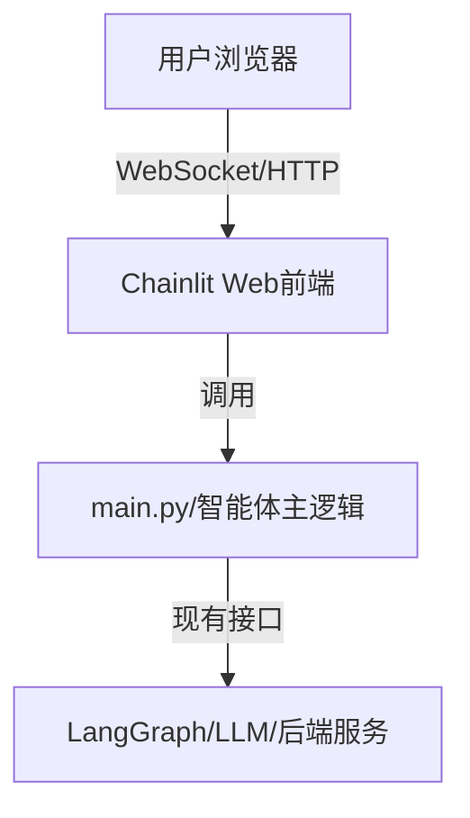

---

## 一、背景与目标

- **现状**：你的项目目前仅有 CLI 交互，没有 Web 前端，用户体验和可视化能力有限。
- **目标**：利用 Chainlit 快速为现有 langgraph 智能体项目集成一个现代化 Web 聊天前端，提升交互体验，且不破坏现有 CLI 逻辑，保持代码整洁、可维护。

---

## 二、Chainlit 快速集成原理与最佳实践

### 1. Chainlit 原理（官方文档总结）

- Chainlit 是一个开源 Python 包，可以用装饰器和命令行工具，将你的 LLM 应用包装成 Web 聊天界面。
- 只需在主入口（如 main.py）用 `@cl.on_message` 装饰你的主逻辑函数，然后用 `chainlit run main.py` 启动服务即可。
- 支持文本、图片、文件、富文本等多种交互，且与 LangChain、OpenAI、Llama 等主流 LLM 框架无缝集成。
- 推荐在虚拟环境中安装和运行，避免全局污染。

> 参考：[Chainlit 官方文档](https://docs.chainlit.cn/)

---

### 2. context7 检索与最佳集成方式

- context7 检索结果与官方文档一致，推荐直接在主入口用装饰器包裹主逻辑，最小化侵入式改造。
- 支持异步/同步、消息生命周期、用户会话、富交互等高级特性。
- 支持与现有 Python 代码无缝集成，无需重写业务逻辑。

---

## 三、详细集成设计方案

### 1. 架构设计



- **A**：用户通过浏览器访问 Chainlit 自动生成的聊天界面。
- **B**：Chainlit 前端负责消息收发、UI 渲染。
- **C**：你的主逻辑（main.py），通过 Chainlit 装饰器暴露为 Web 服务。
- **D**：原有的 LangGraph 智能体、LLM、数据库等后端服务。

---

### 2. 代码集成步骤

#### 步骤一：安装 Chainlit

- 推荐在虚拟环境中安装，命令如下：
  ```bash
  uv add chainlit
  ```

#### 步骤二：主逻辑改造（main.py）

- 找到主入口（如 main.py），将核心对话逻辑抽象为函数。
- 用 Chainlit 装饰器包裹，示例代码如下：

  ```python
  import chainlit as cl

  @cl.on_message
  async def handle_message(message: cl.Message):
      # 调用原有的 LLM/智能体逻辑
      response = my_langgraph_agent(message.content)
      await cl.Message(content=response).send()
  ```

- 保留原有 CLI 入口，兼容 CLI 和 Web 两种模式。

#### 步骤三：启动服务

- 在虚拟环境下运行：
  ```bash
  chainlit run main.py
  ```
- 默认在本地 8000 端口启动 Web 聊天界面。

#### 步骤四：进阶功能（可选）

- 支持多轮对话、文件上传、图片展示等。
- 可自定义 UI、主题、Logo、身份认证等。

---

### 3. 详细集成计划

| 阶段         | 任务                                                         | 负责人 | 预计工时 |
|--------------|--------------------------------------------------------------|--------|----------|
| 需求分析     | 明确集成目标、梳理现有主逻辑                                 | 架构师 | 0.5 天   |
| 环境准备     | 创建/激活虚拟环境，安装 Chainlit                             | 运维   | 0.5 天   |
| 代码改造     | 主入口函数抽象、添加 Chainlit 装饰器，兼容 CLI/Web           | 开发   | 1 天     |
| 本地测试     | 启动 Chainlit，验证 Web 聊天功能，兼容性测试                 | 测试   | 0.5 天   |
| 进阶集成     | 多轮对话、文件/图片、UI 定制、身份认证（如有需求）           | 开发   | 1 天     |
| 文档与交付   | 更新 README，输出集成文档和使用说明                          | 架构师 | 0.5 天   |

---

### 4. 关键注意事项

- **最小侵入**：只需在主入口加装饰器，原有 CLI 逻辑不受影响。
- **虚拟环境**：强烈建议用虚拟环境，避免依赖冲突。
- **测试**：务必在 tests 目录下补充 Web 端到端测试用例。
- **文档**：集成后及时更新 README 和相关文档，便于团队协作和后续维护。

---

## 四、后续行动计划

1. 评审本设计方案，团队确认无误后执行。
2. 按计划分工推进，优先实现最小可用集成（MVP）。
3. 完成后进行端到端测试，确保 CLI/Web 均可用。
4. 输出/更新集成文档和 README。
5. 反思集成过程，优化代码结构和用户体验。

---

## 参考资料

- [Chainlit 官方文档](https://docs.chainlit.cn/)

---

