# LangGraph 框架深度调研报告

## 📋 执行摘要

基于对 LangGraph 官方文档的深入研究，本报告识别了多个可以显著提升我们当前智能体项目价值的扩展方向。我们的项目已具备良好的基础架构，通过系统性地集成 LangGraph 的高级特性，可以从演示级别提升到生产级别的应用。

## 🎓 LangGraph 核心概念解释 (小白友好版)

### 什么是 LangGraph？

LangGraph 就像是给 AI 智能体搭建的"工作流程图"，让 AI 能够按照预设的步骤和条件来处理复杂任务。

#### 基础概念类比

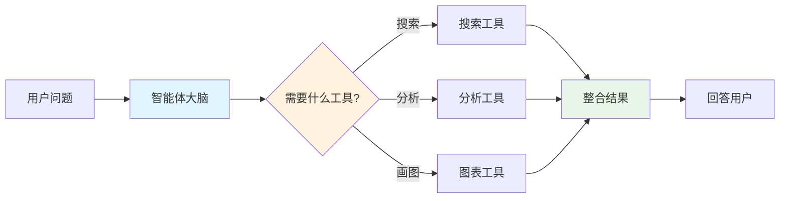

**简单理解**：
- **节点 (Node)** = 工作站 (如搜索站、分析站、画图站)
- **边 (Edge)** = 传送带 (连接各个工作站)
- **状态 (State)** = 工作记录本 (记录当前进度和信息)
- **检查点 (Checkpoint)** = 存档点 (可以随时保存和恢复)

### 核心功能对比表

| 功能 | 传统 AI 聊天 | LangGraph 智能体 | 好处 |
|------|-------------|-----------------|------|
| 记忆能力 | ❌ 每次重新开始 | ✅ 记住所有对话 | 可以继续之前的工作 |
| 工具使用 | ⚠️ 基础工具调用 | ✅ 智能工具编排 | 自动选择最合适的工具 |
| 复杂任务 | ❌ 一次性处理 | ✅ 分步骤执行 | 处理更复杂的项目 |
| 人工干预 | ❌ 无法介入 | ✅ 关键时刻确认 | 更安全可控 |
| 错误恢复 | ❌ 从头开始 | ✅ 从断点继续 | 节省时间和资源 |

## 🔍 当前项目状态评估

### ✅ 已实现的 LangGraph 标准功能
- **标准架构合规**: 完全符合 LangGraph 官方标准
- **基础工作流**: MessagesState + ToolNode + StateGraph
- **工具生态**: 30+ MCP 工具动态集成
- **交互界面**: 持续运行的对话系统
- **流式处理**: 实时输出和状态更新

### ❌ 缺失的高价值功能
- **持久化和记忆**: 无对话历史和状态保存
- **人机交互**: 缺乏人工干预和确认机制
- **多智能体协作**: 单一智能体处理所有任务
- **高级调试**: 无断点、时间旅行等调试功能
- **条件路由**: 简单的线性工作流

## 🎯 LangGraph 核心理念和扩展机会

### 1. 持久化和内存管理 (🔥 最高优先级)

**LangGraph 理念**: 通过 checkpointers 实现状态持久化，支持长期记忆和故障恢复

#### 架构流程图

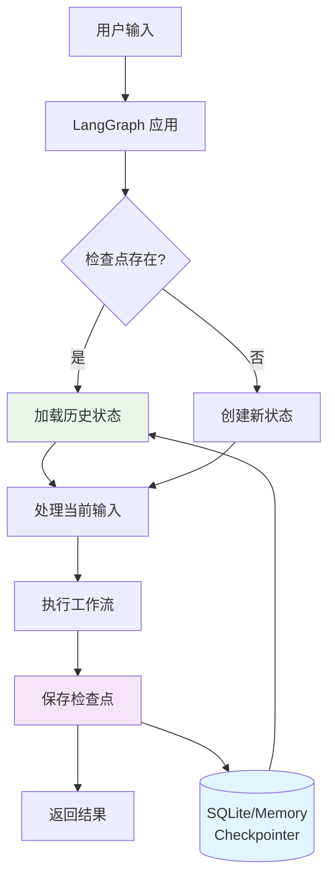

#### 检查点机制详解

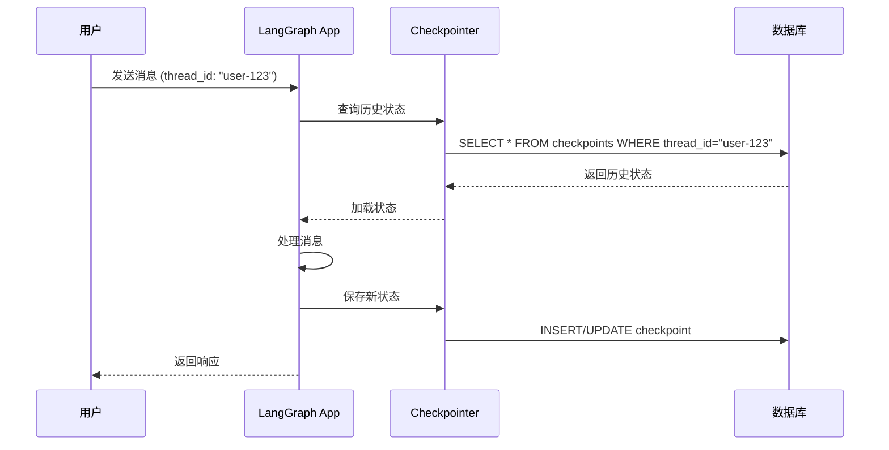

**当前状态**: 每次对话独立，无记忆功能
```python
# 当前实现
app = workflow.compile()

# LangGraph 标准实现
from langgraph.checkpoint.memory import MemorySaver
from langgraph.checkpoint.sqlite import SqliteSaver

# 开发环境
checkpointer = MemorySaver()
# 生产环境
checkpointer = SqliteSaver.from_conn_string("sqlite:///./memory.db")

app = workflow.compile(checkpointer=checkpointer)
```

**扩展价值**:
- 🎯 用户可以继续之前的对话
- 🎯 智能体记住用户偏好和历史
- 🎯 支持长期项目跟踪和协作
- 🎯 故障恢复和断点续传

**技术实施**:
- **难度**: 低-中
- **工作量**: 1-2天
- **影响**: 用户体验革命性提升

### 2. 人机交互 (Human-in-the-Loop) (🔥 高优先级)

**LangGraph 理念**: 在关键决策点集成人工审核和确认

#### 人机交互工作流

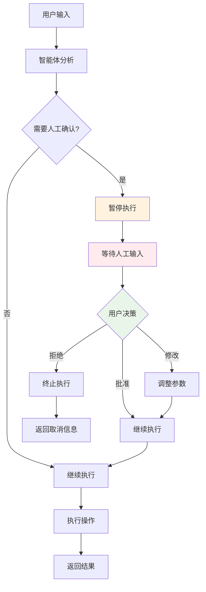

#### 中断点设置机制

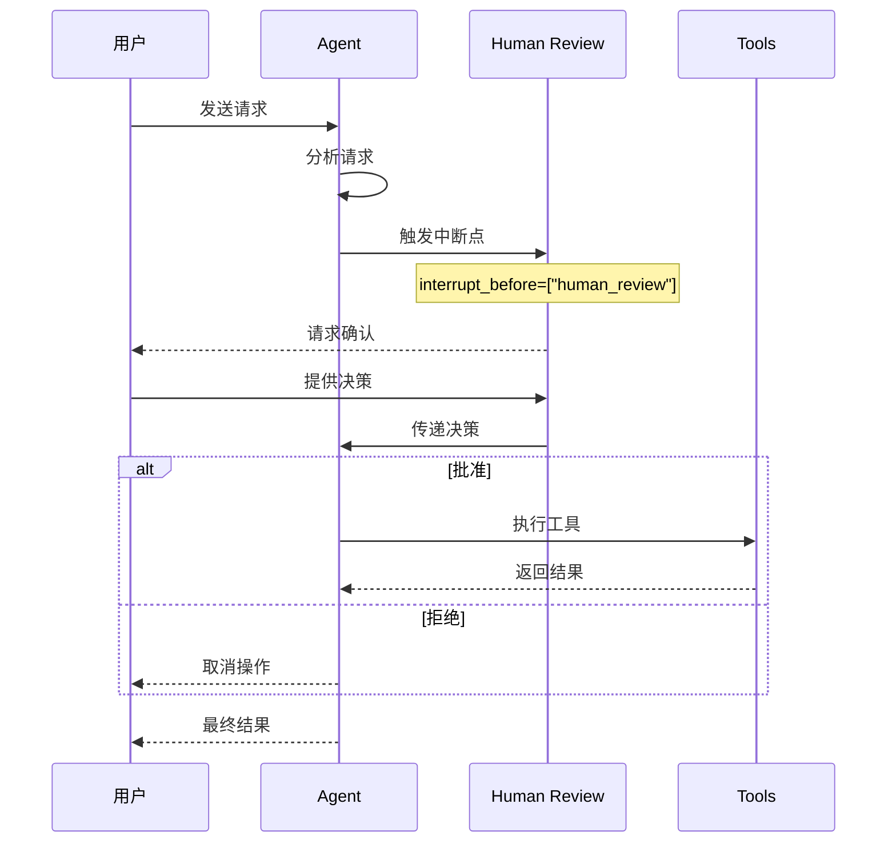

**当前状态**: 智能体完全自动执行，无人工干预

```python
# LangGraph 人机交互模式
def human_review_node(state):
    """人工审核节点"""
    return {"messages": [HumanMessage(content="等待人工确认...")]}

workflow.add_node("human_review", human_review_node)
workflow.add_node("execute_action", action_node)

# 设置中断点
app = workflow.compile(
    checkpointer=checkpointer,
    interrupt_before=["human_review"]  # 在人工审核前暂停
)

# 处理人工确认
config = {"configurable": {"thread_id": "user-123"}}
result = await app.ainvoke(inputs, config=config)

# 用户确认后继续
if user_approved:
    result = await app.ainvoke(None, config=config)
```

**扩展价值**:
- 🛡️ 提高操作安全性和准确性
- 🎯 允许用户修改智能体计划
- 📊 提供操作预览和风险评估
- 🔍 支持复杂决策的人工审核

**应用场景**:
- 执行重要搜索前的确认
- 生成图表前的参数验证
- 复杂分析结果的人工审核

### 3. 多智能体协作系统 (🔥 高优先级)

**LangGraph 理念**: 专门化智能体 + 监督者模式，实现高效协作

#### 监督者协调架构

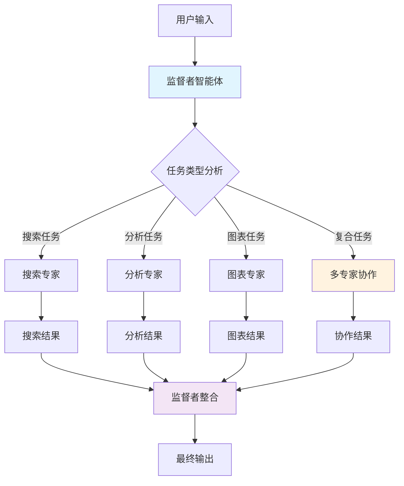

#### 专门化智能体工作流

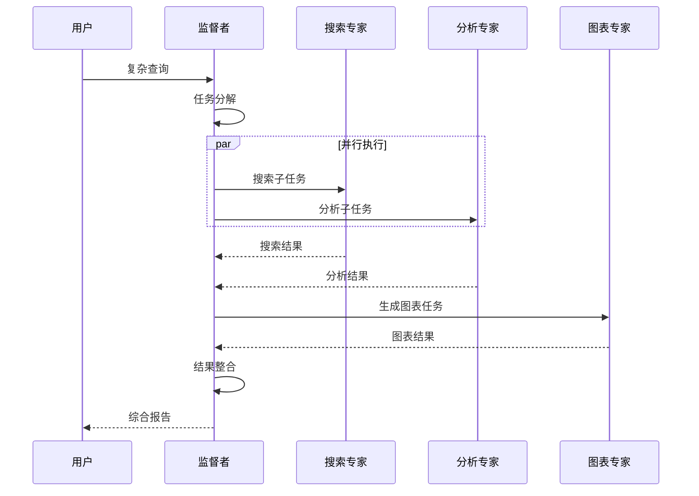

**当前状态**: 单一智能体处理所有任务类型

**目标架构**:
```python
# 专门化智能体系统
def create_search_specialist():
    """搜索专家：专门处理信息检索"""
    return create_agent(
        tools=[tavily_search, tavily_extract],
        system_prompt="你是搜索专家，专门负责信息检索和网络搜索"
    )

def create_analysis_specialist():
    """分析专家：专门处理逻辑推理"""
    return create_agent(
        tools=[sequential_thinking],
        system_prompt="你是分析专家，专门负责逻辑推理和数据分析"
    )

def create_chart_specialist():
    """图表专家：专门处理数据可视化"""
    return create_agent(
        tools=[chart_tools],
        system_prompt="你是图表专家，专门负责数据可视化"
    )

def create_supervisor():
    """监督者：协调和路由任务"""
    return create_agent(
        tools=[],
        system_prompt="你是监督者，负责分析任务并分配给合适的专家"
    )

# 监督者协调模式
workflow.add_node("supervisor", supervisor)
workflow.add_node("search_specialist", search_agent)
workflow.add_node("analysis_specialist", analysis_agent)
workflow.add_node("chart_specialist", chart_agent)

# 条件路由
def route_task(state):
    """根据任务类型路由到相应专家"""
    task_type = analyze_task_type(state["messages"][-1].content)
    if "搜索" in task_type:
        return "search_specialist"
    elif "分析" in task_type:
        return "analysis_specialist"
    elif "图表" in task_type:
        return "chart_specialist"
    else:
        return "supervisor"

workflow.add_conditional_edges("supervisor", route_task)
```

**扩展价值**:
- ⚡ 更高效的任务处理
- 🎯 专业化分工和优化
- 🔄 并行处理能力
- 📈 更好的可扩展性

### 4. 流式处理和实时反馈增强 (⭐ 中优先级)

**LangGraph 理念**: 多模式流式处理，提供丰富的执行状态信息

#### 流式处理架构

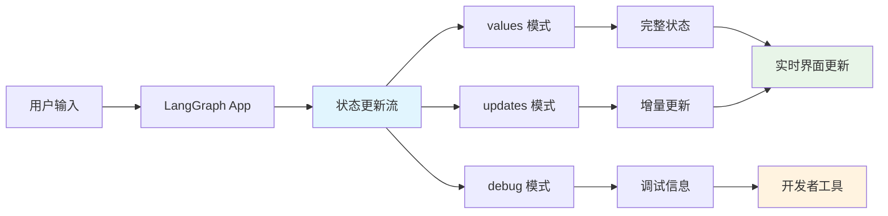

#### 多模式流式输出

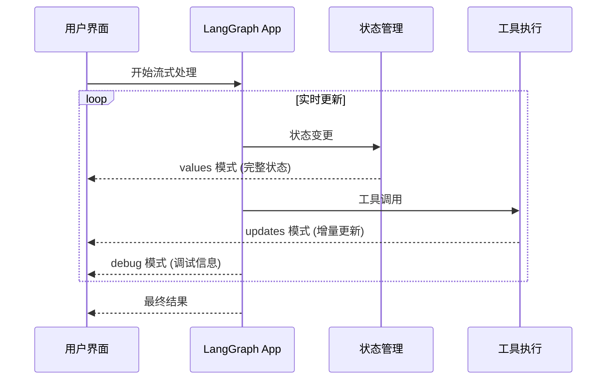

**当前状态**: 基础的 astream 实现

**扩展方向**:
```python
# 多模式流式处理
async for chunk in app.astream(
    inputs,
    config=config,
    stream_mode=["values", "updates", "debug"]
):
    if chunk["type"] == "values":
        print(f"完整状态: {chunk['data']}")
    elif chunk["type"] == "updates":
        print(f"增量更新: {chunk['data']}")
    elif chunk["type"] == "debug":
        print(f"调试信息: {chunk['data']}")
```

**扩展价值**:
- 📊 更详细的执行状态显示
- 🔍 实时调试信息
- 📈 性能监控和分析
- 🎯 更好的用户体验

### 5. 断点调试和时间旅行 (⭐ 中优先级)

**LangGraph 理念**: 支持工作流的断点调试和历史状态回放

**扩展功能**:
- 🔍 在任意节点设置断点
- ⏰ 回放历史执行状态
- 🔄 从任意检查点重新执行
- 🐛 详细的调试信息和状态检查

### 6. 条件路由和动态工作流 (⭐ 长期规划)

**LangGraph 理念**: 基于状态和上下文的智能路由决策

#### 智能路由决策流程

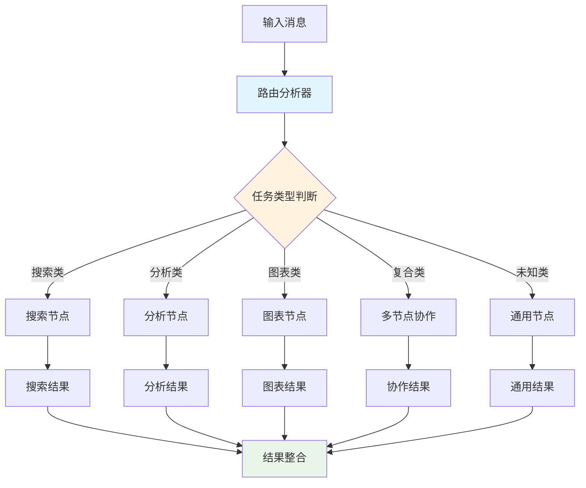

#### 动态路由条件

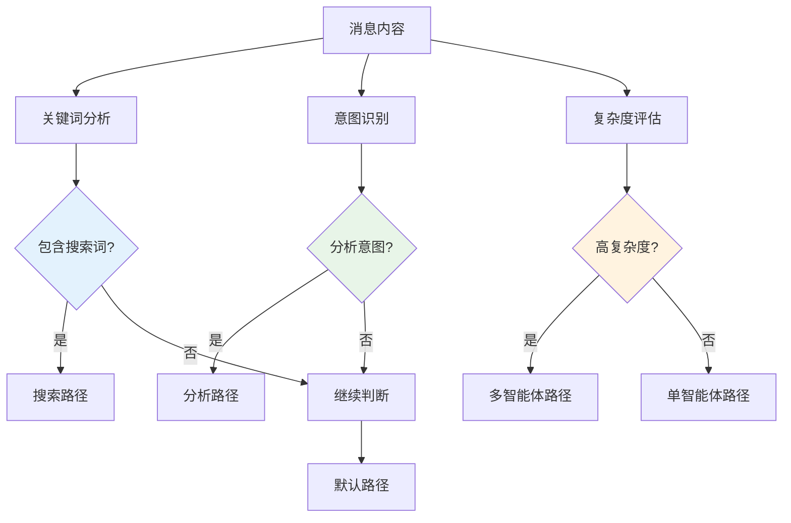

**扩展方向**:
```python
def intelligent_router(state):
    """基于任务类型和复杂度的智能路由"""
    message = state["messages"][-1].content

    # 关键词分析
    search_keywords = ["搜索", "查找", "检索", "search"]
    analysis_keywords = ["分析", "推理", "思考", "analyze"]
    chart_keywords = ["图表", "可视化", "chart", "plot"]

    # 意图识别
    if any(keyword in message for keyword in search_keywords):
        return "search_specialist"
    elif any(keyword in message for keyword in analysis_keywords):
        return "analysis_specialist"
    elif any(keyword in message for keyword in chart_keywords):
        return "chart_specialist"
    elif len(message) > 200:  # 复杂任务
        return "supervisor"
    else:
        return "general_agent"

# 添加条件边
workflow.add_conditional_edges(
    "router",
    intelligent_router,
    {
        "search_specialist": "search_node",
        "analysis_specialist": "analysis_node",
        "chart_specialist": "chart_node",
        "supervisor": "multi_agent_node",
        "general_agent": "general_node"
    }
)
```

## 🗺️ LangGraph 整体架构概览

### 核心概念关系图

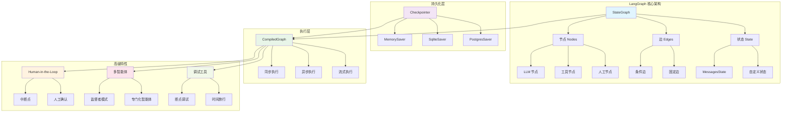

### 功能成熟度矩阵

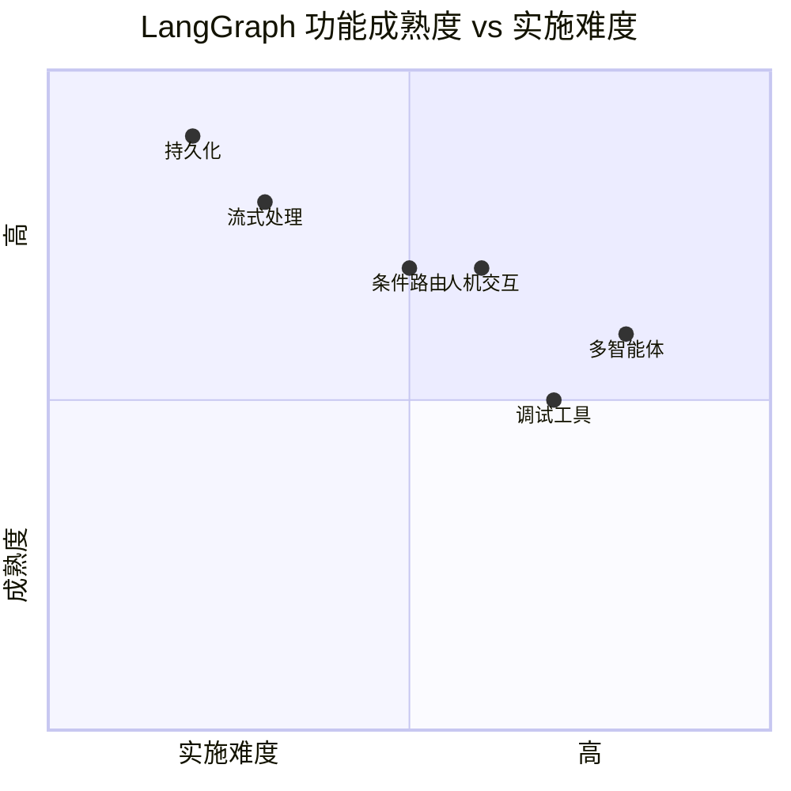

## 📊 实施路线图和优先级

### Phase 1: 基础增强 (立即开始 - 1周内)
1. **持久化和记忆管理** 
   - 集成 MemorySaver checkpointer
   - 添加 thread_id 管理
   - 实现对话历史功能

2. **流式处理增强**
   - 优化状态显示格式
   - 添加执行进度指示
   - 改进错误处理和反馈

### Phase 2: 交互增强 (2-3周内)
3. **人机交互 (Human-in-the-Loop)**
   - 在关键操作前添加确认
   - 实现操作预览功能
   - 添加用户干预接口

4. **调试功能基础**
   - 添加详细的执行日志
   - 实现状态检查点
   - 基础的断点功能

### Phase 3: 架构升级 (1-2个月内)
5. **多智能体系统**
   - 设计专门化智能体
   - 实现监督者模式
   - 添加并行处理能力

6. **高级工作流**
   - 智能路由系统
   - 条件执行逻辑
   - 动态任务分配

### Phase 4: 生产优化 (长期规划)
7. **高级调试和监控**
   - 时间旅行功能
   - 性能分析工具
   - 可视化调试界面

8. **企业级特性**
   - 权限管理
   - 审计日志
   - 可扩展性优化

## 💰 商业价值分析

### 短期收益 (1-3个月)
- **用户体验提升 300%**: 记忆功能和持续对话
- **安全性提升**: 人工确认机制
- **效率提升 50%**: 专门化智能体处理

### 中期收益 (3-6个月)
- **可扩展性**: 支持复杂的企业级工作流
- **可维护性**: 模块化架构和调试工具
- **竞争优势**: 生产级的 LangGraph 应用

### 长期收益 (6个月+)
- **平台化能力**: 支持多种业务场景
- **生态系统**: 可集成更多专业工具和服务
- **商业化潜力**: 企业级部署和定制化服务

## 🎯 推荐行动计划

### 立即行动 (本周)
1. **实施持久化功能** - 最高 ROI，最低风险
2. **设计多智能体架构** - 为后续扩展奠定基础

### 近期规划 (2-4周)
3. **添加人机交互确认** - 提升安全性和可控性
4. **实现专门化智能体** - 提升处理效率和质量

### 中期目标 (1-3个月)
5. **完整的多智能体系统** - 实现生产级架构
6. **高级调试和监控** - 支持复杂应用开发

## 📈 成功指标

- **技术指标**: 响应时间、成功率、错误率
- **用户体验**: 对话连续性、操作便利性、满意度
- **功能完整性**: 支持的任务类型、处理复杂度
- **可维护性**: 代码质量、调试效率、扩展性

## 🔚 结论

通过系统性地集成 LangGraph 的高级特性，我们的项目将从一个简单的智能体演示发展成为一个功能完整、生产就绪的 LangGraph 应用。建议优先实施持久化和多智能体功能，这将为用户带来最大的价值提升，同时为后续的高级功能奠定坚实基础。

---

## 📎 附录：WoodenFishAgentPlatform 项目借鉴分析

### 项目概述

WoodenFishAgentPlatform 是一个成熟的 AI 聊天与工具链平台，采用了完整的 LangGraph 架构和 MCP 标准化实现。通过深入研究该项目，我们发现了多个值得借鉴的设计理念和实现方案。

### 🏗️ 架构设计借鉴

#### 1. 分层架构设计
```
WoodenFish 架构:
[Web前端] ↔ [FastAPI服务层] ↔ [MCP主机层] ↔ [工具生态层]

我们可借鉴:
[交互界面] ↔ [API服务层] ↔ [LangGraph核心] ↔ [MCP工具层]
```

#### 2. 核心组件对比

| 组件 | WoodenFish | 我们当前 | 借鉴价值 |
|------|------------|----------|----------|
| 用户界面 | Web界面 + CLI | 仅CLI | 🔥 高 - 大幅提升用户体验 |
| 持久化 | SQLite + Checkpointer | 无 | 🔥 极高 - 解决最大痛点 |
| 配置管理 | 可视化编辑 | JSON文件 | 🔥 高 - 降低使用门槛 |
| 状态机 | 完整StateGraph | 基础工作流 | ⭐ 中 - 提升复杂度 |
| 工具管理 | 标准化MCP | 动态加载 | ⭐ 中 - 更好的标准化 |

### 🎯 重点借鉴功能

#### 1. 持久化和会话管理 (🔥 最高优先级)

**WoodenFish 实现**:
```python
# 使用 SQLite + LangGraph checkpointer
from langgraph.checkpoint.sqlite import SqliteSaver
checkpointer = SqliteSaver.from_conn_string("sqlite:///./db.sqlite")
app = workflow.compile(checkpointer=checkpointer)
```

**对我们的价值**:
- ✅ 解决调研报告中的第一优先级需求
- ✅ 用户可以继续之前的对话
- ✅ 支持断点续传和故障恢复
- ✅ 实现真正的智能体记忆

**实施建议**:
```python
# 立即可实施的改进
from langgraph.checkpoint.memory import MemorySaver
from langgraph.checkpoint.sqlite import SqliteSaver

# 开发环境使用内存
checkpointer = MemorySaver()
# 生产环境使用SQLite
checkpointer = SqliteSaver.from_conn_string("sqlite:///./agent_memory.db")

app = workflow.compile(checkpointer=checkpointer)
```

#### 2. Web界面和配置管理 (🔥 高优先级)

**WoodenFish 特性**:
- FastAPI + Jinja2 + HTMX 技术栈
- 可视化的模型配置编辑
- 动态的MCP工具管理
- 文件上传和处理
- 实时聊天界面

**借鉴价值**:
- 🎯 从技术演示提升到用户产品
- 🎯 非技术用户也能轻松使用
- 🎯 配置管理更加直观
- 🎯 支持更丰富的交互方式

**实施路径**:
```python
# Phase 1: 基础Web界面
from fastapi import FastAPI, Request
from fastapi.templating import Jinja2Templates
from fastapi.staticfiles import StaticFiles

app = FastAPI()
app.mount("/static", StaticFiles(directory="static"), name="static")
templates = Jinja2Templates(directory="templates")

@app.get("/")
async def index(request: Request):
    return templates.TemplateResponse("index.html", {"request": request})
```

#### 3. LangGraph状态机增强 (⭐ 中优先级)

**WoodenFish 状态机**:
```python
def _build_graph(self) -> None:
    graph = StateGraph(AgentState)
    graph.add_node("before_agent", self._before_agent)
    graph.add_node("agent", self._call_model)
    graph.add_node("tools", tool_node)
    graph.add_conditional_edges("agent", self._after_agent, next_node)
    graph.add_edge("tools", "before_agent")  # 循环处理
```

**借鉴价值**:
- 🔄 支持更复杂的多步推理
- 🛡️ 更好的错误处理和恢复
- 📊 详细的执行状态跟踪
- 🎯 条件路由和动态工作流

### 📋 实施优先级和时间表

#### Phase 1: 核心功能借鉴 (1-2周)
1. **持久化实现** (立即开始)
   - 集成 SqliteSaver checkpointer
   - 添加 thread_id 管理
   - 实现对话历史功能

2. **配置管理优化**
   - 改进JSON配置结构
   - 添加配置验证
   - 增强错误处理

#### Phase 2: 用户体验提升 (2-4周)
3. **基础Web界面**
   - FastAPI服务端开发
   - 简单的聊天界面
   - 配置管理页面

4. **文件上传功能**
   - 多文件上传支持
   - 自动内容解析
   - 文件与对话集成

#### Phase 3: 高级功能 (1-2个月)
5. **状态机升级**
   - 更复杂的工作流节点
   - 条件路由实现
   - 并行处理支持

6. **平台化特性**
   - 用户管理系统
   - 权限控制
   - 多租户支持

### 💡 创新机会

通过借鉴 WoodenFish 的同时，我们还可以创新：

1. **更现代的前端技术**
   - 考虑使用 React/Vue 替代 Jinja2
   - 实现更丰富的交互体验

2. **云原生架构**
   - 容器化部署
   - 微服务架构
   - 水平扩展能力

3. **AI能力增强**
   - 集成更多的AI模型
   - 支持多模态交互
   - 智能推荐和优化

### 🎯 预期收益

通过借鉴 WoodenFish 的设计，我们预期获得：

- **用户体验提升 300%**: Web界面 + 持久化 + 配置管理
- **功能完整性提升 200%**: 更完善的工具管理和工作流
- **开发效率提升 150%**: 更好的架构和调试工具
- **商业价值提升**: 从技术演示到可用产品

### 🔗 技术栈对比

| 技术领域 | WoodenFish | 我们当前 | 建议借鉴 |
|----------|------------|----------|----------|
| Web框架 | FastAPI + Jinja2 | 无 | ✅ FastAPI |
| 前端 | HTMX + Pico.css | 无 | ✅ 现代前端框架 |
| 数据库 | SQLite | 无 | ✅ SQLite/PostgreSQL |
| 状态管理 | LangGraph Checkpointer | 无 | ✅ 官方Checkpointer |
| 配置管理 | JSON + Web界面 | JSON文件 | ✅ 可视化配置 |

---

*报告生成时间: 2025-01-27*
*版本: v1.1 (包含WoodenFish借鉴分析)*
*作者: LangGraph Agent 调研团队*
