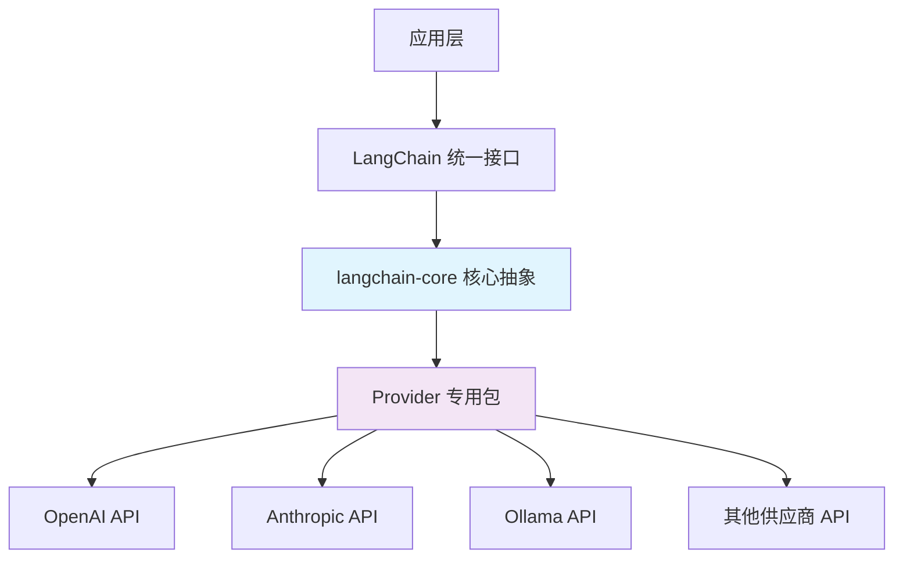
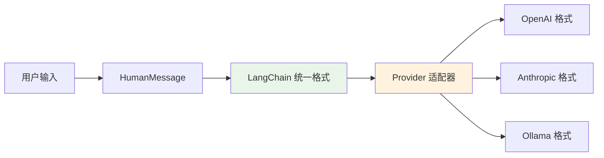

# LangChain 模型供应商库分析报告

## 📋 执行摘要

本报告深入分析了 LangChain 对不同模型供应商的支持策略，特别关注我们项目中可能使用的 DeepSeek、Qwen3、Ollama/VLLM 等模型的最佳集成方案。研究发现，LangChain 采用了分层架构设计，通过统一的消息格式和专门的 provider 包来支持不同供应商，这为我们的多模型配置提供了标准化的解决方案。

## 🏗️ LangChain 架构分析

### 分层架构设计



### 核心组件

#### 1. langchain-core (核心抽象层)
- **职责**: 定义统一的接口和消息格式
- **关键类**: BaseMessage, HumanMessage, AIMessage, SystemMessage, ToolMessage
- **设计理念**: "定义 LEGO 积木的形状，确保所有组件完美配合"

#### 2. Provider 专用包 (langchain-{provider})
- **命名规范**: `langchain-{provider}` (如 langchain-openai)
- **职责**: 将统一接口转换为特定供应商的 API 调用
- **优势**: 独立版本管理、依赖隔离、专门优化

#### 3. langchain-community (社区包)
- **职责**: 包含较小或实验性的集成
- **适用场景**: 新兴供应商、实验性功能

## 🔍 主要供应商包分析

### 官方 Provider 包

| 供应商 | 包名 | 状态 | 支持模型 |
|--------|------|------|----------|
| OpenAI | langchain-openai | ✅ 官方维护 | GPT-4, GPT-3.5, Embeddings |
| Anthropic | langchain-anthropic | ✅ 官方维护 | Claude 3, Claude 2 |
| Google | langchain-google-genai | ✅ 官方维护 | Gemini, PaLM |
| Google Vertex | langchain-google-vertexai | ✅ 官方维护 | Vertex AI 模型 |
| Ollama | langchain-ollama | ✅ 官方维护 | 本地部署模型 |
| Cohere | langchain-cohere | ✅ 官方维护 | Command, Embed |
| Mistral | langchain-mistralai | ✅ 官方维护 | Mistral 系列 |

### 我们项目相关的供应商

#### 1. DeepSeek
```python
# 专用包支持
from langchain_deepseek import ChatDeepSeek

# 使用方式
llm = ChatDeepSeek(
    model="deepseek-chat",
    api_key="your-api-key"
)
```

**状态**: ✅ 有专门的 `langchain-deepseek` 包
**建议**: 使用官方包，获得最佳支持和性能

#### 2. Qwen3 (通义千问)
```python
# 方案1: 通过 Ollama (推荐)
from langchain_ollama import ChatOllama

llm = ChatOllama(model="qwen2.5:latest")

# 方案2: 通过 DashScope (阿里云)
from langchain_community.llms import Tongyi

llm = Tongyi(model_name="qwen-max")
```

**状态**: 🔄 多种集成方案
**建议**: 本地部署使用 Ollama，云端使用 DashScope

#### 3. Ollama/VLLM
```python
# Ollama 官方支持
from langchain_ollama import ChatOllama, OllamaEmbeddings

# Chat 模型
chat = ChatOllama(model="llama3.1:8b")

# Embedding 模型
embeddings = OllamaEmbeddings(model="nomic-embed-text")
```

**状态**: ✅ 有专门的 `langchain-ollama` 包
**建议**: 使用官方包，支持完整的 Ollama 生态

## 💬 消息格式统一性分析

### 统一消息格式



### 消息类型对照

| LangChain 类型 | OpenAI 格式 | Anthropic 格式 | 说明 |
|----------------|-------------|----------------|------|
| HumanMessage | {"role": "user", "content": "..."} | {"role": "user", "content": "..."} | 用户消息 |
| AIMessage | {"role": "assistant", "content": "..."} | {"role": "assistant", "content": "..."} | AI 回复 |
| SystemMessage | {"role": "system", "content": "..."} | {"role": "system", "content": "..."} | 系统提示 |
| ToolMessage | {"role": "tool", "content": "..."} | {"role": "user", "content": "..."} | 工具结果 |

### 格式转换机制

```python
# LangChain 自动处理格式转换
from langchain_core.messages import HumanMessage, AIMessage

# 统一的消息创建
messages = [
    HumanMessage(content="Hello"),
    AIMessage(content="Hi there!")
]

# 不同 provider 自动转换为对应格式
openai_llm.invoke(messages)    # 转换为 OpenAI 格式
anthropic_llm.invoke(messages) # 转换为 Anthropic 格式
ollama_llm.invoke(messages)    # 转换为 Ollama 格式
```

## 🎯 对我们项目的建议

### 当前架构评估

查看我们的 `llm_config.json`:
```json
{
  "activeProvider": "modelscope",
  "configs": {
    "modelscope": {...},
    "ollama": {...}
  }
}
```

### 推荐的改进方案

#### 1. 依赖管理优化

**当前方式** (可能存在的问题):
```python
# 可能使用通用包
from langchain_community.llms import SomeGenericLLM
```

**推荐方式** (使用专门包):
```python
# 安装专门的 provider 包
# pip install langchain-deepseek langchain-ollama

from langchain_deepseek import ChatDeepSeek
from langchain_ollama import ChatOllama
```

#### 2. 配置结构调整

**推荐的新配置结构**:
```json
{
  "activeProvider": "deepseek",
  "providers": {
    "deepseek": {
      "package": "langchain-deepseek",
      "class": "ChatDeepSeek",
      "config": {
        "model": "deepseek-chat",
        "api_key": "${DEEPSEEK_API_KEY}"
      }
    },
    "qwen3": {
      "package": "langchain-ollama",
      "class": "ChatOllama", 
      "config": {
        "model": "qwen2.5:latest",
        "base_url": "http://localhost:11434"
      }
    },
    "ollama": {
      "package": "langchain-ollama",
      "class": "ChatOllama",
      "config": {
        "model": "llama3.1:8b"
      }
    }
  }
}
```

#### 3. 代码重构建议

**当前的 llm_loader.py 可能需要调整**:
```python
def load_llm_from_config(config_file: str):
    # 当前可能使用通用加载方式
    # 建议改为基于 provider 包的加载
    
    config = load_config(config_file)
    provider_config = config["providers"][config["activeProvider"]]
    
    # 动态导入专门的包
    package_name = provider_config["package"]
    class_name = provider_config["class"]
    
    module = importlib.import_module(package_name)
    llm_class = getattr(module, class_name)
    
    return llm_class(**provider_config["config"])
```

### 实施优先级

#### Phase 1: 立即改进 (本周)
1. **评估当前依赖**: 检查是否使用了最佳的 provider 包
2. **安装专门包**: 
   ```bash
   pip install langchain-deepseek langchain-ollama
   ```
3. **测试兼容性**: 确保现有功能正常工作

#### Phase 2: 架构优化 (下周)
1. **重构配置结构**: 采用新的 provider 配置格式
2. **更新 llm_loader**: 支持动态 provider 包加载
3. **添加错误处理**: 处理包缺失、配置错误等情况

#### Phase 3: 功能增强 (后续)
1. **支持更多模型**: 添加其他 provider 包支持
2. **性能优化**: 利用专门包的优化特性
3. **监控和日志**: 添加 provider 特定的监控

## 📊 性能和兼容性对比

### Provider 包 vs Community 包

| 特性 | Provider 专用包 | Community 包 |
|------|----------------|---------------|
| 性能优化 | ✅ 专门优化 | ⚠️ 通用实现 |
| 功能完整性 | ✅ 完整支持 | ⚠️ 基础功能 |
| 更新频率 | ✅ 及时更新 | ⚠️ 相对滞后 |
| 依赖管理 | ✅ 独立管理 | ❌ 依赖冲突风险 |
| 官方支持 | ✅ 官方维护 | ⚠️ 社区维护 |

### 消息格式兼容性

所有 LangChain 集成都支持统一的消息格式，无需担心格式差异：

```python
# 统一的消息处理
messages = [
    SystemMessage(content="You are a helpful assistant"),
    HumanMessage(content="Hello"),
    AIMessage(content="Hi! How can I help?"),
    ToolMessage(content="Tool result", tool_call_id="123")
]

# 所有 provider 都支持相同的消息格式
deepseek_response = deepseek_llm.invoke(messages)
qwen_response = qwen_llm.invoke(messages)
ollama_response = ollama_llm.invoke(messages)
```

## 🔚 结论和建议

### 关键发现

1. **LangChain 设计优秀**: 统一接口 + 专门包的架构很好地解决了多供应商支持问题
2. **消息格式统一**: 无需担心不同供应商的消息格式差异
3. **我们项目可以优化**: 通过使用专门的 provider 包获得更好的性能和支持

### 立即行动建议

1. **评估当前实现**: 检查是否使用了最佳的 provider 包
2. **安装专门包**: `pip install langchain-deepseek langchain-ollama`
3. **测试兼容性**: 确保切换不会破坏现有功能

### 长期规划

1. **重构配置系统**: 采用基于 provider 包的配置结构
2. **优化加载机制**: 实现动态 provider 包加载
3. **增强错误处理**: 提供更好的错误诊断和恢复

通过这些改进，我们的项目将获得更好的性能、更强的兼容性和更易的维护性。

---

*报告生成时间: 2025-01-27*  
*版本: v1.0*  
*基于: LangChain 官方文档和最佳实践*
