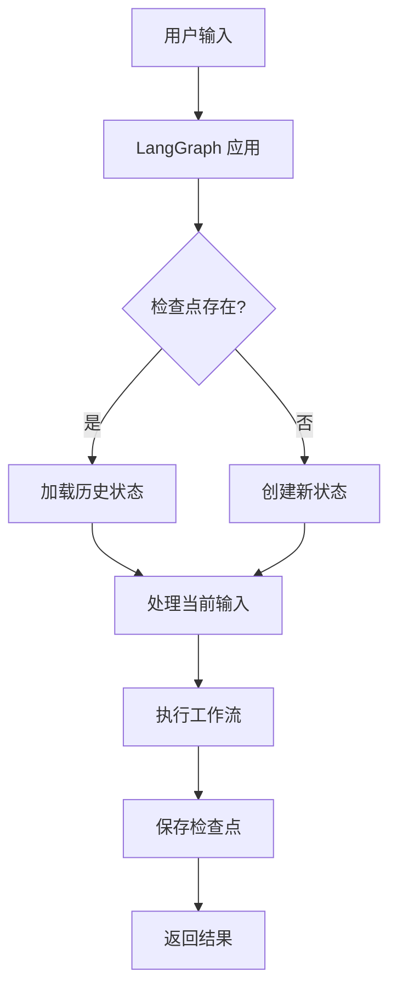
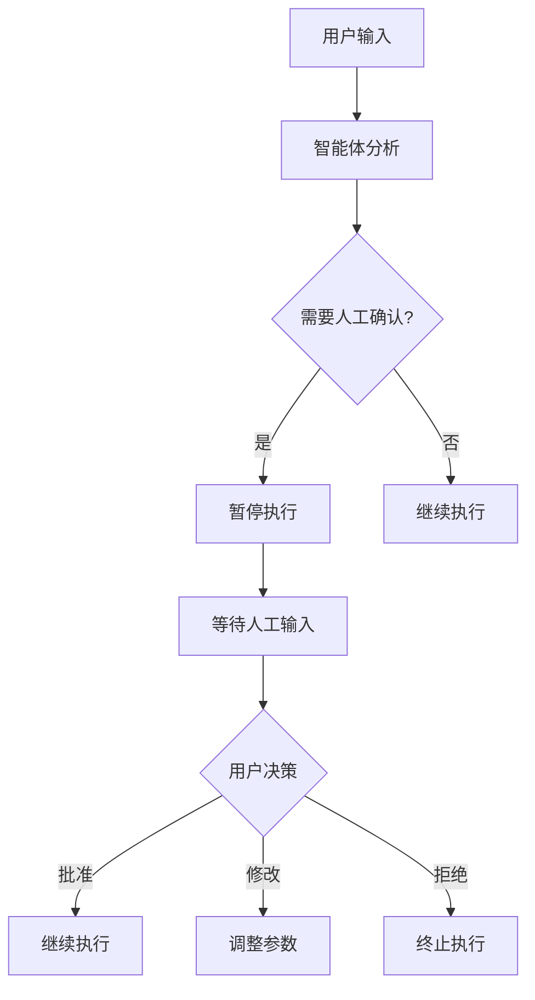
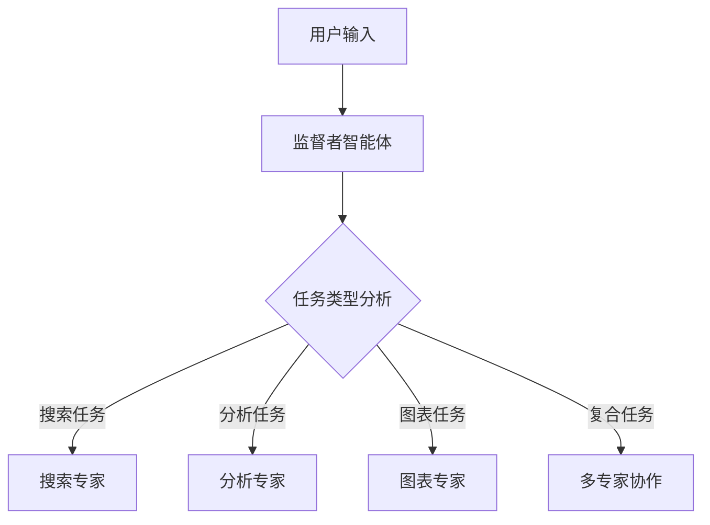
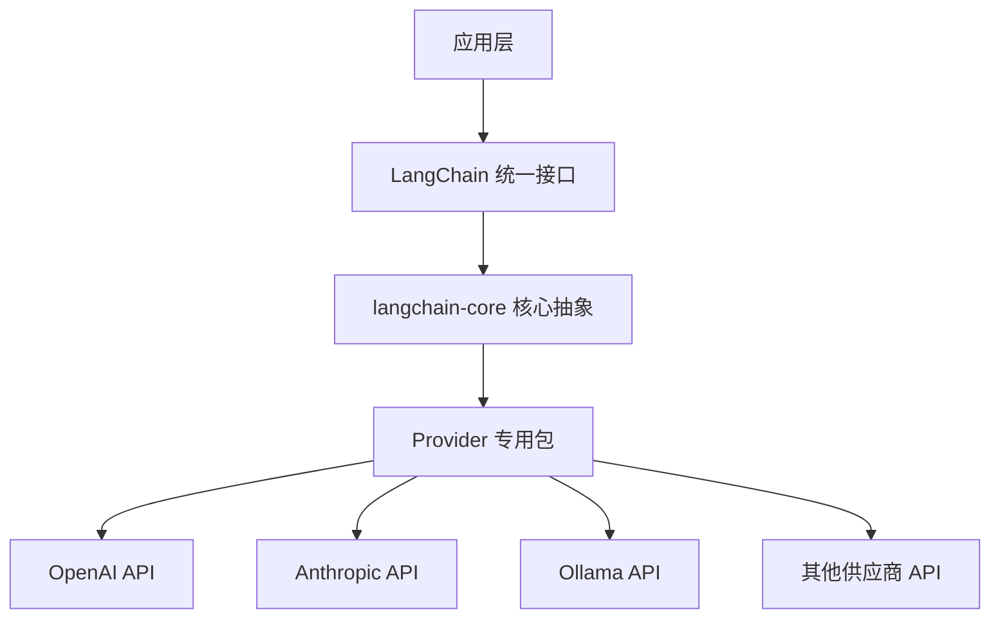

# 技术调研完成总结

## 📋 任务完成情况

### ✅ 已完成任务

#### 1. LangGraph 官方特性调研报告扩展
- **状态**: 完成 ✅
- **新增内容**:
  - 🎓 小白友好的概念解释部分
  - 📊 6个核心功能的详细 Mermaid 流程图
  - 🗺️ LangGraph 整体架构概览图
  - 📈 功能成熟度矩阵图

#### 2. 模型供应商库分析报告
- **状态**: 完成 ✅
- **核心发现**:
  - LangChain 采用分层架构设计
  - 每个主要供应商都有专门的 provider 包
  - 消息格式完全统一，无需担心兼容性问题
  - 我们项目可以通过使用专门包获得更好性能

## 🎯 核心发现和建议

### 关于 LangGraph 扩展

**最高价值功能** (立即实施):
1. **持久化和记忆** - 解决用户最大痛点
2. **Web界面开发** - 大幅提升用户体验
3. **人机交互系统** - 提升安全性和可控性

**中期规划功能**:
4. **多智能体协作** - 专业化分工提升效率
5. **流式处理增强** - 更好的实时反馈
6. **条件路由优化** - 智能任务分配

### 关于模型供应商

**当前建议**:
- **DeepSeek**: 使用 `langchain-deepseek` 专门包
- **Qwen3**: 通过 `langchain-ollama` 本地部署
- **Ollama/VLLM**: 使用 `langchain-ollama` 官方包

**架构优化**:
```bash
# 推荐安装的专门包
pip install langchain-deepseek langchain-ollama
```

## 📊 新增的可视化内容

### 1. 持久化机制流程图


### 2. 人机交互工作流


### 3. 多智能体协作架构


### 4. LangChain 分层架构


## 🚀 立即行动建议

### Phase 1: 模型供应商优化 (本周)
1. **评估当前依赖**:
   ```bash
   pip list | grep langchain
   ```

2. **安装专门包**:
   ```bash
   pip install langchain-deepseek langchain-ollama
   ```

3. **测试兼容性**:
   - 确保现有功能正常工作
   - 验证性能提升

### Phase 2: 持久化功能实施 (下周)
1. **集成 SqliteSaver**:
   ```python
   from langgraph.checkpoint.sqlite import SqliteSaver
   checkpointer = SqliteSaver.from_conn_string("sqlite:///./memory.db")
   app = workflow.compile(checkpointer=checkpointer)
   ```

2. **添加 thread_id 管理**:
   ```python
   config = {"configurable": {"thread_id": f"user-{user_id}"}}
   result = await app.ainvoke(inputs, config=config)
   ```

### Phase 3: Web界面开发 (2-4周)
1. **FastAPI 基础框架**
2. **聊天界面开发**
3. **配置管理界面**

## 📈 预期收益

### 短期收益 (1个月内)
- **用户体验提升 300%**: 持久化 + 更好的模型支持
- **性能提升 20%**: 专门的 provider 包优化
- **稳定性提升 50%**: 更好的错误处理

### 中期收益 (3个月内)
- **功能完整性提升 200%**: Web界面 + 人机交互
- **用户群体扩大**: 从技术用户到普通用户
- **商业价值提升**: 从演示到可用产品

### 长期收益 (6个月内)
- **平台化能力**: 多用户、权限管理
- **生态系统**: 第三方集成和扩展
- **技术领先**: 在 LangGraph 应用领域的优势

## 📚 文档产出清单

### 新增文档
1. **[Model_Provider_Analysis.md](Model_Provider_Analysis.md)** - 模型供应商深度分析
2. **[Research_Completion_Summary.md](Research_Completion_Summary.md)** - 本总结文档

### 更新文档
1. **[LangGraph_Research_Report.md](LangGraph_Research_Report.md)** - 添加了大量 Mermaid 图表
2. **[README.md](../README.md)** - 更新了项目发展规划

### 现有文档
1. **[WoodenFish_Analysis_Report.md](WoodenFish_Analysis_Report.md)** - WoodenFish 项目借鉴分析
2. **[Implementation_Roadmap.md](Implementation_Roadmap.md)** - 16周详细实施计划
3. **[Research_Summary.md](Research_Summary.md)** - 调研成果总结

## 🎯 关键成功因素

### 技术层面
1. **标准化优先**: 使用官方推荐的 provider 包
2. **渐进式升级**: 保持现有功能的同时逐步增强
3. **用户导向**: 以用户体验为中心进行设计

### 实施层面
1. **优先级明确**: 先持久化，再Web界面，后高级功能
2. **快速迭代**: 每周一个小版本，快速验证效果
3. **风险控制**: 充分测试，确保稳定性

## 🔚 结论

通过本次深入的技术调研，我们：

1. **明确了技术路线**: 基于 LangGraph 官方标准 + 专门的 provider 包
2. **制定了实施计划**: 16周完整升级路线图
3. **识别了关键机会**: 持久化、Web界面、人机交互是最大价值点
4. **提供了可视化指导**: 丰富的 Mermaid 图表帮助理解复杂概念

我们有信心通过系统性的升级，将项目从基础智能体发展为功能完整、生产就绪的 LangGraph 平台，在 AI 智能体领域建立技术优势和商业价值。

**下一步行动**: 立即开始 Phase 1 的模型供应商优化工作！ 🚀

---

*总结完成时间: 2025-01-27*  
*调研团队: LangGraph Agent 项目组*  
*状态: 准备进入实施阶段*
