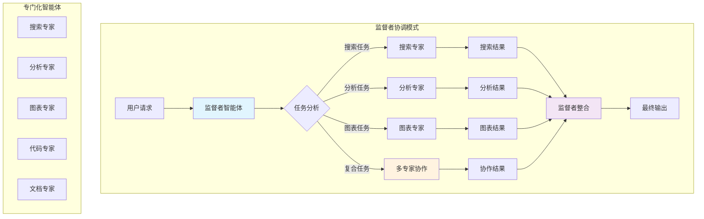
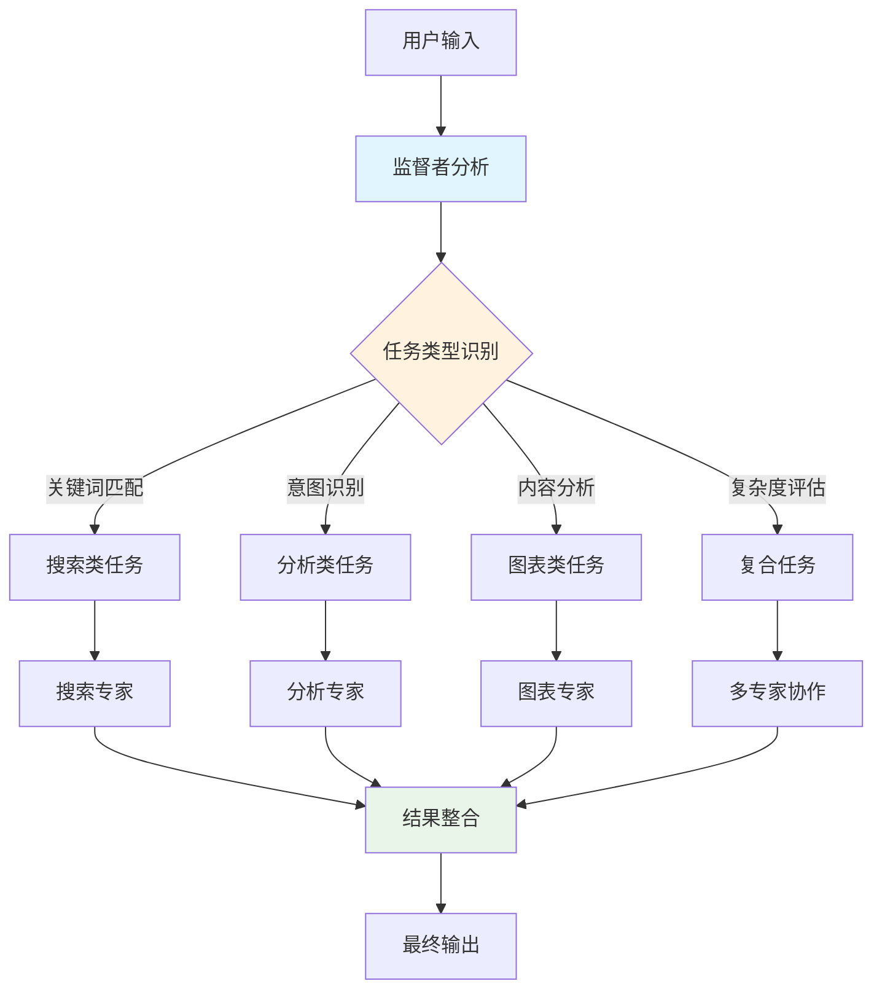

# LangGraph 多智能体协作集成分析及实施计划

## 📋 执行摘要

基于对 LangGraph 官方多智能体架构的深入研究，本文档提供了完整的多智能体协作系统集成方案。该方案将把我们的单一智能体系统升级为具备专门化分工、监督者协调和并行处理能力的多智能体协作平台。

## 🎯 核心目标

- **专门化智能体**：创建针对不同任务类型的专业智能体
- **监督者协调**：实现智能的任务分配和结果整合
- **并行处理**：支持多个智能体同时工作
- **动态路由**：基于任务特征的智能路由决策

## 🔍 技术深度分析

### 1. LangGraph 多智能体架构原理

#### 核心架构模式



#### 官方推荐的实现模式

**1. 监督者模式（Supervisor Pattern）**：
- 中央监督者负责任务分配和协调
- 专门化智能体处理特定类型任务
- 所有通信通过监督者进行

**2. 网络模式（Network Pattern）**：
- 智能体之间可以直接通信
- 更灵活但复杂度更高
- 适合复杂的协作场景

**3. 层次化团队（Hierarchical Teams）**：
- 多层级的监督者结构
- 支持大规模智能体组织
- 适合企业级应用

### 2. 当前项目架构分析

#### 现有架构优势
- ✅ **标准 LangGraph 基础**：完全符合官方规范
- ✅ **工具生态完善**：30+ MCP 工具可供分配
- ✅ **模块化设计**：易于扩展为多智能体
- ✅ **流式处理**：支持实时状态更新

#### 单智能体局限性
- ❌ **任务处理效率低**：所有任务由单一智能体处理
- ❌ **专业化程度不足**：缺乏针对性优化
- ❌ **并行处理能力缺失**：无法同时处理多个子任务
- ❌ **扩展性受限**：难以适应复杂业务场景

### 3. 多智能体系统设计

#### 3.1 智能体角色定义

**监督者智能体（Supervisor Agent）**：
- **职责**：任务分析、智能体选择、结果整合
- **工具**：智能体切换工具（handoff tools）
- **特点**：不直接处理业务任务，专注协调

**搜索专家（Search Specialist）**：
- **职责**：信息检索、网络搜索、内容提取
- **工具**：tavily_search, tavily_extract, tavily_crawl
- **优化**：针对搜索任务的 prompt 优化

**分析专家（Analysis Specialist）**：
- **职责**：逻辑推理、数据分析、复杂思考
- **工具**：sequential_thinking, 数据处理工具
- **优化**：针对分析任务的推理能力增强

**图表专家（Chart Specialist）**：
- **职责**：数据可视化、图表生成、报告制作
- **工具**：render_mermaid, 图表生成工具
- **优化**：专业的可视化设计能力

**代码专家（Code Specialist）**：
- **职责**：代码编写、调试、技术实现
- **工具**：代码执行、文件操作工具
- **优化**：编程和技术问题解决

#### 3.2 任务路由策略

**智能路由决策流程**：


**路由规则设计**：
```python
def intelligent_router(state: MessagesState) -> str:
    """智能任务路由器"""
    message = state["messages"][-1].content
    
    # 关键词匹配
    search_keywords = ["搜索", "查找", "检索", "search", "find"]
    analysis_keywords = ["分析", "推理", "思考", "analyze", "think"]
    chart_keywords = ["图表", "可视化", "chart", "plot", "diagram"]
    code_keywords = ["代码", "编程", "code", "program", "script"]
    
    # 复杂度评估
    complexity_score = calculate_complexity(message)
    
    # 路由决策
    if any(keyword in message.lower() for keyword in search_keywords):
        return "search_specialist"
    elif any(keyword in message.lower() for keyword in analysis_keywords):
        return "analysis_specialist"
    elif any(keyword in message.lower() for keyword in chart_keywords):
        return "chart_specialist"
    elif any(keyword in message.lower() for keyword in code_keywords):
        return "code_specialist"
    elif complexity_score > 0.7:  # 复杂任务需要多专家协作
        return "multi_agent_collaboration"
    else:
        return "general_agent"  # 回退到通用处理
```

## 🛠️ 详细实施计划

### Phase 1: 基础多智能体架构（第1-2周）

#### 1.1 项目结构重构

```
my_project/
├── main.py                    # 主程序（需重构）
├── agents/                    # 新增：智能体模块
│   ├── __init__.py
│   ├── base_agent.py         # 基础智能体类
│   ├── supervisor.py         # 监督者智能体
│   ├── specialists/          # 专门化智能体
│   │   ├── __init__.py
│   │   ├── search_specialist.py
│   │   ├── analysis_specialist.py
│   │   ├── chart_specialist.py
│   │   └── code_specialist.py
│   └── routing/              # 路由模块
│       ├── __init__.py
│       ├── task_router.py
│       └── handoff_tools.py
├── workflows/                # 新增：工作流模块
│   ├── __init__.py
│   ├── multi_agent_workflow.py
│   └── single_agent_workflow.py
└── config/
    └── agents_config.json    # 新增：智能体配置
```

#### 1.2 基础智能体类设计

**基础智能体抽象类**：
```python
# agents/base_agent.py
from abc import ABC, abstractmethod
from langchain_core.messages import BaseMessage
from langgraph.graph import MessagesState
from typing import List, Dict, Any

class BaseAgent(ABC):
    """智能体基类"""
    
    def __init__(self, name: str, description: str, tools: List = None):
        self.name = name
        self.description = description
        self.tools = tools or []
        self.llm = None
        self.agent = None
    
    @abstractmethod
    def create_agent(self):
        """创建智能体实例"""
        pass
    
    @abstractmethod
    def get_system_prompt(self) -> str:
        """获取系统提示词"""
        pass
    
    def get_tools(self) -> List:
        """获取智能体工具"""
        return self.tools
    
    def invoke(self, state: MessagesState) -> Dict[str, Any]:
        """调用智能体"""
        if not self.agent:
            self.create_agent()
        return self.agent.invoke(state)
```

**监督者智能体实现**：
```python
# agents/supervisor.py
from .base_agent import BaseAgent
from langgraph.prebuilt import create_react_agent
from .routing.handoff_tools import create_handoff_tools

class SupervisorAgent(BaseAgent):
    """监督者智能体"""
    
    def __init__(self, llm, available_agents: List[str]):
        self.available_agents = available_agents
        handoff_tools = create_handoff_tools(available_agents)
        
        super().__init__(
            name="supervisor",
            description="任务协调和智能体管理",
            tools=handoff_tools
        )
        self.llm = llm
    
    def get_system_prompt(self) -> str:
        agents_desc = "\n".join([f"- {agent}: 负责{agent}相关任务" 
                                for agent in self.available_agents])
        
        return f"""你是一个智能体监督者，负责协调多个专门化智能体。

可用智能体：
{agents_desc}

你的职责：
1. 分析用户请求，识别任务类型
2. 选择最合适的智能体处理任务
3. 整合各智能体的结果
4. 一次只分配给一个智能体，不要并行调用
5. 不要自己处理具体任务，专注于协调

请根据任务特点选择合适的智能体。"""
    
    def create_agent(self):
        """创建监督者智能体"""
        self.agent = create_react_agent(
            model=self.llm,
            tools=self.tools,
            prompt=self.get_system_prompt(),
            name=self.name
        )
        return self.agent
```

**专门化智能体实现**：
```python
# agents/specialists/search_specialist.py
from ..base_agent import BaseAgent
from langgraph.prebuilt import create_react_agent

class SearchSpecialist(BaseAgent):
    """搜索专家智能体"""
    
    def __init__(self, llm, search_tools):
        super().__init__(
            name="search_specialist",
            description="专门负责信息搜索和检索",
            tools=search_tools
        )
        self.llm = llm
    
    def get_system_prompt(self) -> str:
        return """你是一个搜索专家，专门负责信息检索和网络搜索。

你的专长：
- 网络信息搜索和检索
- 内容提取和整理
- 多源信息整合
- 实时信息获取

工作原则：
1. 使用最合适的搜索策略
2. 提供准确、及时的信息
3. 整理和总结搜索结果
4. 标注信息来源和可靠性

请专注于搜索任务，提供高质量的信息检索服务。"""
    
    def create_agent(self):
        """创建搜索专家智能体"""
        self.agent = create_react_agent(
            model=self.llm,
            tools=self.tools,
            prompt=self.get_system_prompt(),
            name=self.name
        )
        return self.agent
```

#### 1.3 切换工具实现

**智能体切换工具**：
```python
# agents/routing/handoff_tools.py
from langchain_core.tools import tool
from langgraph.types import Command
from typing import Annotated, Literal

def create_handoff_tools(available_agents: List[str]):
    """创建智能体切换工具"""
    handoff_tools = []
    
    for agent_name in available_agents:
        @tool(name=f"transfer_to_{agent_name}")
        def handoff_tool(
            task_description: Annotated[str, "任务描述和相关上下文"],
            state: Annotated[MessagesState, "当前状态"]
        ) -> Command:
            """切换到指定智能体"""
            # 创建任务消息
            task_message = HumanMessage(content=task_description)
            
            # 更新状态并切换到目标智能体
            return Command(
                update={"messages": state["messages"] + [task_message]},
                goto=agent_name
            )
        
        # 动态设置工具名称和描述
        handoff_tool.name = f"transfer_to_{agent_name}"
        handoff_tool.description = f"将任务分配给{agent_name}智能体"
        
        handoff_tools.append(handoff_tool)
    
    return handoff_tools
```

### Phase 2: 多智能体工作流构建（第3-4周）

#### 2.1 多智能体工作流实现

**工作流构建器**：
```python
# workflows/multi_agent_workflow.py
from langgraph.graph import StateGraph, MessagesState, START, END
from agents.supervisor import SupervisorAgent
from agents.specialists import *

class MultiAgentWorkflow:
    """多智能体工作流"""
    
    def __init__(self, llm, tools_dict):
        self.llm = llm
        self.tools_dict = tools_dict
        self.agents = {}
        self.workflow = None
        self.app = None
    
    def create_specialists(self):
        """创建专门化智能体"""
        # 搜索专家
        search_tools = [tool for tool in self.tools_dict.get("search", []) 
                       if "search" in tool.name.lower()]
        self.agents["search_specialist"] = SearchSpecialist(self.llm, search_tools)
        
        # 分析专家
        analysis_tools = [tool for tool in self.tools_dict.get("analysis", [])
                         if "thinking" in tool.name.lower()]
        self.agents["analysis_specialist"] = AnalysisSpecialist(self.llm, analysis_tools)
        
        # 图表专家
        chart_tools = [tool for tool in self.tools_dict.get("chart", [])
                      if "mermaid" in tool.name.lower()]
        self.agents["chart_specialist"] = ChartSpecialist(self.llm, chart_tools)
    
    def create_supervisor(self):
        """创建监督者智能体"""
        available_agents = list(self.agents.keys())
        self.agents["supervisor"] = SupervisorAgent(self.llm, available_agents)
    
    def build_workflow(self):
        """构建多智能体工作流"""
        # 创建智能体
        self.create_specialists()
        self.create_supervisor()
        
        # 构建状态图
        self.workflow = StateGraph(MessagesState)
        
        # 添加智能体节点
        for agent_name, agent in self.agents.items():
            self.workflow.add_node(agent_name, agent.invoke)
        
        # 设置入口点
        self.workflow.add_edge(START, "supervisor")
        
        # 添加从专家回到监督者的边
        for agent_name in self.agents.keys():
            if agent_name != "supervisor":
                self.workflow.add_edge(agent_name, "supervisor")
        
        # 监督者可以结束流程
        self.workflow.add_edge("supervisor", END)
        
        return self.workflow
    
    def compile(self, checkpointer=None):
        """编译工作流"""
        if not self.workflow:
            self.build_workflow()
        
        self.app = self.workflow.compile(checkpointer=checkpointer)
        return self.app
```

#### 2.2 主程序集成

**修改 main.py 支持多智能体**：
```python
# main.py 关键修改
from workflows.multi_agent_workflow import MultiAgentWorkflow
from workflows.single_agent_workflow import SingleAgentWorkflow

async def initialize_agent():
    """初始化Agent组件并构建工作流"""
    print("--- 初始化多智能体系统 ---")
    
    # 加载配置
    llm = load_llm_from_config("config/llm_config.json")
    _, tools = await load_mcp_tools_from_config("config/mcp_config.json")
    
    # 工具分类
    tools_dict = categorize_tools(tools)
    
    # 选择工作流模式
    mode = input("选择模式 (1: 单智能体, 2: 多智能体): ").strip()
    
    if mode == "2":
        # 多智能体模式
        workflow_builder = MultiAgentWorkflow(llm, tools_dict)
        app = workflow_builder.compile()
        print("🤖 多智能体系统初始化完成")
    else:
        # 单智能体模式（兼容现有功能）
        workflow_builder = SingleAgentWorkflow(llm, tools)
        app = workflow_builder.compile()
        print("🤖 单智能体系统初始化完成")
    
    return app, tools

def categorize_tools(tools):
    """工具分类"""
    tools_dict = {
        "search": [],
        "analysis": [],
        "chart": [],
        "code": [],
        "general": []
    }
    
    for tool in tools:
        tool_name = tool.name.lower()
        if any(keyword in tool_name for keyword in ["search", "tavily", "web"]):
            tools_dict["search"].append(tool)
        elif any(keyword in tool_name for keyword in ["thinking", "analyze"]):
            tools_dict["analysis"].append(tool)
        elif any(keyword in tool_name for keyword in ["mermaid", "chart", "plot"]):
            tools_dict["chart"].append(tool)
        elif any(keyword in tool_name for keyword in ["code", "python", "script"]):
            tools_dict["code"].append(tool)
        else:
            tools_dict["general"].append(tool)
    
    return tools_dict
```

### Phase 3: 高级协作功能（第5-6周）

#### 3.1 并行处理支持

**并行任务执行**：
```python
from langgraph.types import Send

def parallel_task_dispatcher(state: MessagesState):
    """并行任务分发器"""
    message = state["messages"][-1].content
    
    # 分析是否需要并行处理
    if requires_parallel_processing(message):
        subtasks = decompose_task(message)
        
        # 创建并行发送指令
        sends = []
        for subtask in subtasks:
            agent_name = select_agent_for_task(subtask)
            task_state = {"messages": [HumanMessage(content=subtask)]}
            sends.append(Send(agent_name, task_state))
        
        return sends
    else:
        # 单一任务处理
        return {"messages": state["messages"]}
```

#### 3.2 结果整合机制

**智能结果整合**：
```python
def result_aggregator(state: MessagesState):
    """结果整合器"""
    messages = state["messages"]
    
    # 提取各智能体的结果
    agent_results = extract_agent_results(messages)
    
    # 使用 LLM 整合结果
    integration_prompt = create_integration_prompt(agent_results)
    integrated_result = llm.invoke(integration_prompt)
    
    return {"messages": messages + [integrated_result]}
```

## 📊 配置文件设计

**agents_config.json**：
```json
{
  "supervisor": {
    "name": "supervisor",
    "description": "任务协调和智能体管理",
    "max_iterations": 10,
    "timeout_seconds": 300
  },
  "specialists": {
    "search_specialist": {
      "name": "search_specialist",
      "description": "信息搜索和检索专家",
      "tools_filter": ["search", "tavily", "web"],
      "max_search_results": 10
    },
    "analysis_specialist": {
      "name": "analysis_specialist", 
      "description": "逻辑推理和数据分析专家",
      "tools_filter": ["thinking", "analyze"],
      "max_thinking_steps": 20
    },
    "chart_specialist": {
      "name": "chart_specialist",
      "description": "数据可视化和图表专家", 
      "tools_filter": ["mermaid", "chart", "plot"],
      "supported_formats": ["mermaid", "svg", "png"]
    }
  },
  "routing": {
    "enable_intelligent_routing": true,
    "fallback_agent": "supervisor",
    "max_handoffs": 5,
    "enable_parallel_processing": false
  }
}
```

## 🧪 测试策略

### 多智能体协作测试
```python
# tests/test_multi_agent.py
async def test_task_routing():
    """测试任务路由"""
    # 搜索任务应该路由到搜索专家
    search_query = "搜索最新的AI发展趋势"
    result = await app.ainvoke({"messages": [HumanMessage(content=search_query)]})
    assert "search_specialist" in str(result)

async def test_result_integration():
    """测试结果整合"""
    # 复杂任务应该整合多个智能体的结果
    complex_query = "分析AI市场趋势并制作图表"
    result = await app.ainvoke({"messages": [HumanMessage(content=complex_query)]})
    # 验证结果包含搜索、分析和图表内容
    pass
```

## ⚠️ 风险评估与缓解

### 技术风险
1. **智能体协调复杂性**：多智能体间的协调可能出现死锁
   - 缓解：设置超时机制，限制最大切换次数

2. **结果一致性**：不同智能体的输出格式可能不一致
   - 缓解：标准化输出格式，统一结果处理

3. **性能开销**：多智能体系统的资源消耗更大
   - 缓解：智能缓存，按需激活智能体

### 业务风险
1. **用户体验复杂化**：多智能体可能让用户困惑
   - 缓解：透明的执行过程展示，清晰的角色说明

2. **成本增加**：多个 LLM 调用增加成本
   - 缓解：智能路由减少不必要调用，使用成本控制

## 📈 成功指标

### 功能指标
- ✅ 任务路由准确率 > 90%
- ✅ 专家智能体专业度提升 > 50%
- ✅ 复杂任务处理成功率 > 85%

### 性能指标
- ⚡ 智能体切换延迟 < 200ms
- ⚡ 并行处理效率提升 > 40%
- ⚡ 整体响应时间控制在合理范围

### 用户体验指标
- 😊 任务完成质量提升 > 60%
- 😊 用户满意度 > 4.5/5
- 😊 系统易用性保持现有水平

## 🚀 实施时间表

| 阶段 | 时间 | 主要任务 | 交付物 |
|------|------|----------|--------|
| Phase 1 | 第1-2周 | 基础架构搭建 | 智能体基类、监督者、专家 |
| Phase 2 | 第3-4周 | 工作流集成 | 多智能体工作流、路由系统 |
| Phase 3 | 第5-6周 | 高级功能开发 | 并行处理、结果整合 |
| 测试优化 | 第7周 | 全面测试和优化 | 测试报告、性能调优 |

## 📝 总结

通过实施本多智能体协作计划，我们的项目将获得：

1. **专业化处理能力**：每个智能体专注于特定领域
2. **智能任务分配**：自动识别任务类型并分配给最合适的专家
3. **并行处理能力**：支持复杂任务的并行执行
4. **可扩展架构**：易于添加新的专门化智能体

这将使我们的系统从单一智能体升级为真正的多智能体协作平台，大幅提升处理复杂任务的能力和效率。
