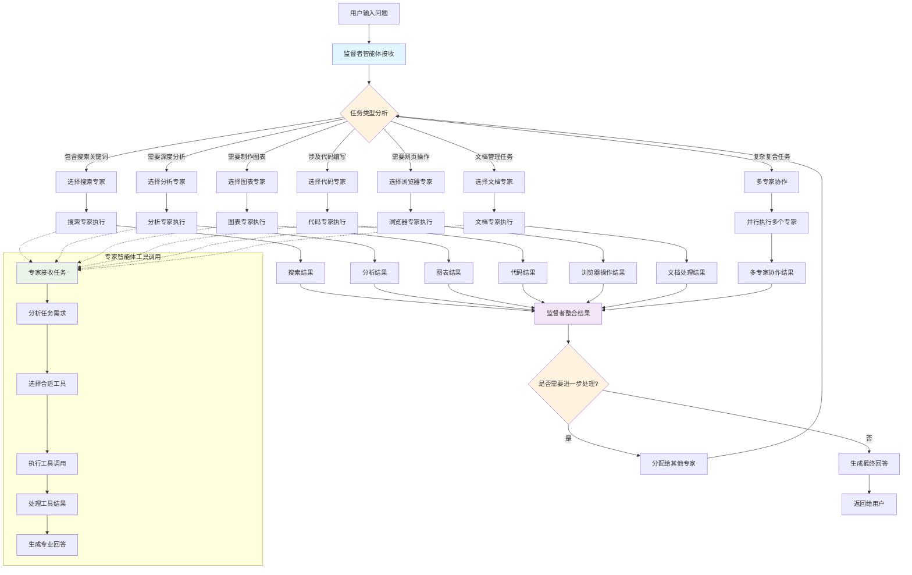

```mermaid
flowchart TD
    A[用户输入问题] --> B[监督者智能体接收]
    B --> C{任务类型分析}
    
    C -->|包含搜索关键词| D[选择搜索专家]
    C -->|需要深度分析| E[选择分析专家]
    C -->|需要制作图表| F[选择图表专家]
    C -->|涉及代码编写| G[选择代码专家]
    C -->|需要网页操作| H[选择浏览器专家]
    C -->|文档管理任务| I[选择文档专家]
    C -->|复杂复合任务| J[多专家协作]
    
    D --> K[搜索专家执行]
    E --> L[分析专家执行]
    F --> M[图表专家执行]
    G --> N[代码专家执行]
    H --> O[浏览器专家执行]
    I --> P[文档专家执行]
    J --> Q[并行执行多个专家]
    
    K --> R[搜索结果]
    L --> S[分析结果]
    M --> T[图表结果]
    N --> U[代码结果]
    O --> V[浏览器操作结果]
    P --> W[文档处理结果]
    Q --> X[多专家协作结果]
    
    R --> Y[监督者整合结果]
    S --> Y
    T --> Y
    U --> Y
    V --> Y
    W --> Y
    X --> Y
    
    Y --> Z{是否需要进一步处理?}
    Z -->|是| AA[分配给其他专家]
    Z -->|否| BB[生成最终回答]
    
    AA --> C
    BB --> CC[返回给用户]
    
    subgraph "专家智能体工具调用"
        DD[专家接收任务]
        DD --> EE[分析任务需求]
        EE --> FF[选择合适工具]
        FF --> GG[执行工具调用]
        GG --> HH[处理工具结果]
        HH --> II[生成专业回答]
    end
    
    K -.-> DD
    L -.-> DD
    M -.-> DD
    N -.-> DD
    O -.-> DD
    P -.-> DD
    
    style B fill:#e1f5fe
    style C fill:#fff3e0
    style Y fill:#f3e5f5
    style Z fill:#fff3e0
    style DD fill:#e8f5e8
```    