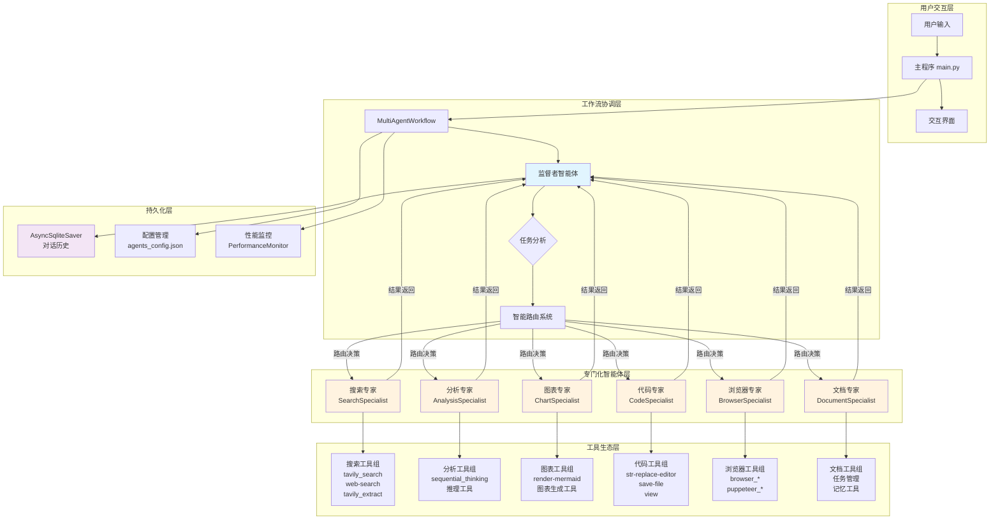

```mermaid
graph TB
    subgraph "用户交互层"
        A[用户输入] --> B[主程序 main.py]
        B --> C[交互界面]
    end
    
    subgraph "工作流协调层"
        D[MultiAgentWorkflow] --> E[监督者智能体]
        E --> F{任务分析}
        F --> G[智能路由系统]
    end
    
    subgraph "专门化智能体层"
        H[搜索专家<br/>SearchSpecialist]
        I[分析专家<br/>AnalysisSpecialist]
        J[图表专家<br/>ChartSpecialist]
        K[代码专家<br/>CodeSpecialist]
        L[浏览器专家<br/>BrowserSpecialist]
        M[文档专家<br/>DocumentSpecialist]
    end
    
    subgraph "工具生态层"
        N[搜索工具组<br/>tavily_search<br/>web-search<br/>tavily_extract]
        O[分析工具组<br/>sequential_thinking<br/>推理工具]
        P[图表工具组<br/>render-mermaid<br/>图表生成工具]
        Q[代码工具组<br/>str-replace-editor<br/>save-file<br/>view]
        R[浏览器工具组<br/>browser_*<br/>puppeteer_*]
        S[文档工具组<br/>任务管理<br/>记忆工具]
    end
    
    subgraph "持久化层"
        T[AsyncSqliteSaver<br/>对话历史]
        U[配置管理<br/>agents_config.json]
        V[性能监控<br/>PerformanceMonitor]
    end
    
    B --> D
    G -->|路由决策| H
    G -->|路由决策| I
    G -->|路由决策| J
    G -->|路由决策| K
    G -->|路由决策| L
    G -->|路由决策| M
    
    H --> N
    I --> O
    J --> P
    K --> Q
    L --> R
    M --> S
    
    H -->|结果返回| E
    I -->|结果返回| E
    J -->|结果返回| E
    K -->|结果返回| E
    L -->|结果返回| E
    M -->|结果返回| E
    
    E --> T
    D --> U
    D --> V
    
    style E fill:#e1f5fe
    style H fill:#fff3e0
    style I fill:#fff3e0
    style J fill:#fff3e0
    style K fill:#fff3e0
    style L fill:#fff3e0
    style M fill:#fff3e0
    style T fill:#f3e5f5
```