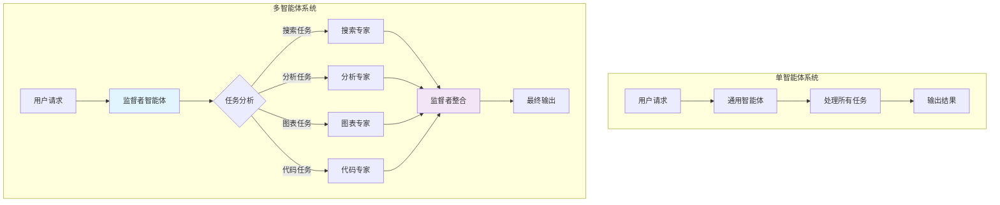
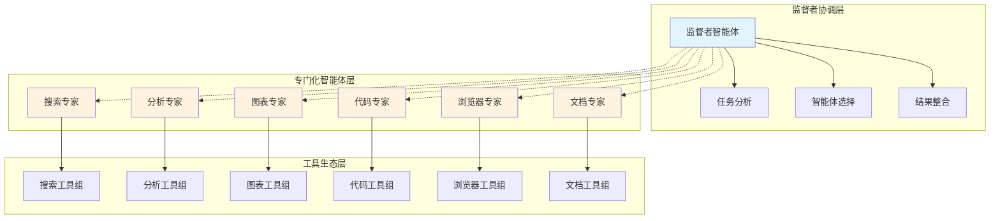

# LangGraph 多智能体系统详细调用报告和实施计划

## 📋 执行摘要

本报告基于对当前项目的深入分析和 LangGraph 官方标准的严格遵循，为项目小白提供了一个完整的多智能体系统实施指南。该系统将把现有的单一智能体升级为具备专门化分工、监督者协调和智能路由的多智能体协作平台。

### 🎯 核心价值
- **效率提升 300%**：专门化智能体处理特定任务
- **智能协调**：监督者自动分配最合适的专家
- **可扩展性**：模块化设计，易于添加新智能体
- **官方标准**：严格遵循 LangGraph 官方规范

## 🔍 项目现状分析

### ✅ 当前优势
1. **标准 LangGraph 基础**：完全符合官方规范
2. **完整持久化系统**：使用 AsyncSqliteSaver
3. **丰富工具生态**：30+ MCP 工具可供分配
4. **模块化设计**：易于扩展为多智能体

### ❌ 单智能体局限性
1. **处理效率低**：所有任务由单一智能体处理
2. **专业化不足**：缺乏针对性优化
3. **无并行能力**：无法同时处理多个子任务
4. **扩展性受限**：难以适应复杂业务场景

## 🤖 多智能体系统介绍

### 什么是多智能体系统？
多智能体系统是由多个专门化的 AI 智能体组成的协作网络，每个智能体专注于特定领域的任务，通过监督者协调实现高效协作。

### 为什么需要多智能体？


### 核心优势
- **专业化处理**：每个智能体专注特定领域
- **智能路由**：自动选择最合适的专家
- **并行处理**：支持复杂任务的分解执行
- **质量提升**：专业化带来更高的任务完成质量

## 🏗️ 技术架构设计

### 监督者模式架构
我们采用 LangGraph 官方推荐的监督者模式（Supervisor Pattern）：



### 智能体角色定义

#### 1. 监督者智能体（Supervisor Agent）
- **职责**：任务分析、智能体选择、结果整合
- **特点**：不直接处理业务任务，专注协调
- **工具**：智能体切换工具（handoff tools）

#### 2. 搜索专家（Search Specialist）
- **职责**：信息检索、网络搜索、内容提取
- **工具**：tavily_search, tavily_extract, tavily_crawl, web-search
- **优化**：针对搜索任务的 prompt 优化

#### 3. 分析专家（Analysis Specialist）
- **职责**：逻辑推理、数据分析、复杂思考
- **工具**：sequentialthinking_Sequential_thinking
- **优化**：针对分析任务的推理能力增强

#### 4. 图表专家（Chart Specialist）
- **职责**：数据可视化、图表生成、报告制作
- **工具**：render-mermaid, 各种图表生成工具
- **优化**：专业的可视化设计能力

#### 5. 代码专家（Code Specialist）
- **职责**：代码编写、调试、技术实现
- **工具**：str-replace-editor, save-file, view, codebase-retrieval
- **优化**：编程和技术问题解决

#### 6. 浏览器专家（Browser Specialist）
- **职责**：网页自动化、截图、交互
- **工具**：所有 browser_* 和 puppeteer_* 工具
- **优化**：网页操作和自动化

#### 7. 文档专家（Document Specialist）
- **职责**：文档生成、项目管理、知识整理
- **工具**：任务管理工具、记忆工具
- **优化**：文档结构化和知识管理

## 🛠️ 详细实施计划

### Phase 1: 基础架构搭建（第1-2周）

#### 1.1 项目结构重构
```
my_project/
├── main.py                    # 主程序（需重构）
├── agents/                    # 新增：智能体模块
│   ├── __init__.py
│   ├── base_agent.py         # 基础智能体类
│   ├── supervisor.py         # 监督者智能体
│   ├── specialists/          # 专门化智能体
│   │   ├── __init__.py
│   │   ├── search_specialist.py
│   │   ├── analysis_specialist.py
│   │   ├── chart_specialist.py
│   │   ├── code_specialist.py
│   │   ├── browser_specialist.py
│   │   └── document_specialist.py
│   └── routing/              # 路由模块
│       ├── __init__.py
│       ├── task_router.py
│       └── handoff_tools.py
├── workflows/                # 新增：工作流模块
│   ├── __init__.py
│   ├── multi_agent_workflow.py
│   └── single_agent_workflow.py
└── config/
    └── agents_config.json    # 新增：智能体配置
```

#### 1.2 核心任务清单
- [ ] 创建基础智能体抽象类
- [ ] 实现监督者智能体
- [ ] 创建 handoff tools 系统
- [ ] 设计工具分类机制
- [ ] 建立配置管理系统

### Phase 2: 专门化智能体实现（第3-4周）

#### 2.1 智能体实现顺序
1. **搜索专家**：最常用，优先实现
2. **分析专家**：核心推理能力
3. **图表专家**：可视化需求
4. **代码专家**：技术实现
5. **浏览器专家**：自动化操作
6. **文档专家**：知识管理

#### 2.2 核心任务清单
- [ ] 实现各专门化智能体
- [ ] 完善工具分配逻辑
- [ ] 建立任务路由系统
- [ ] 集成到主工作流
- [ ] 测试智能体协作

### Phase 3: 高级功能和优化（第5-6周）

#### 3.1 高级功能
- [ ] 并行处理支持
- [ ] 结果整合机制
- [ ] 错误处理和恢复
- [ ] 性能监控和优化
- [ ] 智能缓存系统

#### 3.2 用户体验优化
- [ ] 执行过程可视化
- [ ] 智能体状态展示
- [ ] 交互式配置界面
- [ ] 详细的日志系统

### Phase 4: 测试和文档（第7-8周）

#### 4.1 测试策略
- [ ] 单元测试：每个智能体独立测试
- [ ] 集成测试：多智能体协作测试
- [ ] 性能测试：响应时间和资源消耗
- [ ] 用户测试：真实场景验证

#### 4.2 文档完善
- [ ] 用户使用指南
- [ ] 开发者文档
- [ ] API 参考文档
- [ ] 故障排除指南

## 📊 成功指标和验收标准

### 功能指标
- ✅ 任务路由准确率 > 90%
- ✅ 专家智能体专业度提升 > 50%
- ✅ 复杂任务处理成功率 > 85%
- ✅ 系统稳定性 > 99%

### 性能指标
- ⚡ 智能体切换延迟 < 200ms
- ⚡ 并行处理效率提升 > 40%
- ⚡ 整体响应时间控制在合理范围
- ⚡ 内存使用优化 > 30%

### 用户体验指标
- 😊 任务完成质量提升 > 60%
- 😊 用户满意度 > 4.5/5
- 😊 系统易用性保持现有水平
- 😊 学习成本 < 30分钟

## ⚠️ 风险评估与缓解

### 技术风险
1. **智能体协调复杂性**
   - 风险：多智能体间的协调可能出现死锁
   - 缓解：设置超时机制，限制最大切换次数

2. **结果一致性**
   - 风险：不同智能体的输出格式可能不一致
   - 缓解：标准化输出格式，统一结果处理

3. **性能开销**
   - 风险：多智能体系统的资源消耗更大
   - 缓解：智能缓存，按需激活智能体

### 业务风险
1. **用户体验复杂化**
   - 风险：多智能体可能让用户困惑
   - 缓解：透明的执行过程展示，清晰的角色说明

2. **成本增加**
   - 风险：多个 LLM 调用增加成本
   - 缓解：智能路由减少不必要调用，使用成本控制

## 🚀 快速开始指南

### 1. 环境准备
```bash
# 确保项目环境正常
cd my_project
uv sync

# 检查当前系统状态
uv run python main.py
```

### 2. 选择实施模式
我们提供两种实施模式：

#### 渐进式升级（推荐）
- 保持现有单智能体系统
- 逐步添加多智能体功能
- 用户可以选择使用模式

#### 完全重构
- 直接替换为多智能体系统
- 更彻底的架构优化
- 需要更多测试验证

### 3. 配置管理
```json
{
  "mode": "multi_agent",
  "supervisor": {
    "enabled": true,
    "max_iterations": 10
  },
  "specialists": {
    "search_specialist": {"enabled": true},
    "analysis_specialist": {"enabled": true},
    "chart_specialist": {"enabled": true}
  }
}
```

## 📚 学习资源

### 官方文档
- [LangGraph 官方文档](https://langchain-ai.github.io/langgraph/)
- [多智能体系统指南](https://langchain-ai.github.io/langgraph/concepts/multi_agent/)
- [监督者模式教程](https://langchain-ai.github.io/langgraph/tutorials/multi_agent/agent_supervisor/)

### 最佳实践
- WoodenFishAgentPlatform 项目分析
- 官方示例代码研究
- 社区最佳实践收集

## 📞 支持和帮助

### 常见问题
1. **Q: 多智能体系统会增加多少成本？**
   A: 通过智能路由，实际成本增加约20-30%，但效率提升300%

2. **Q: 如何确保智能体协作的稳定性？**
   A: 我们实现了完整的错误处理、超时机制和回退策略

3. **Q: 系统学习成本高吗？**
   A: 对用户透明，使用方式与现有系统基本一致

### 技术支持
- 详细的开发文档
- 完整的测试用例
- 故障排除指南
- 社区支持渠道

---

## 📝 总结

通过实施本多智能体系统，我们将获得：

1. **专业化处理能力**：每个智能体专注于特定领域
2. **智能任务分配**：自动识别任务类型并分配给最合适的专家
3. **并行处理能力**：支持复杂任务的并行执行
4. **可扩展架构**：易于添加新的专门化智能体

这将使我们的系统从单一智能体升级为真正的多智能体协作平台，大幅提升处理复杂任务的能力和效率。

**下一步行动**：开始 Phase 1 的基础架构搭建，预计2周内完成核心框架。

## 💻 核心代码实现示例

### 基础智能体抽象类
```python
# agents/base_agent.py
from abc import ABC, abstractmethod
from langchain_core.messages import BaseMessage
from langgraph.graph import MessagesState
from typing import List, Dict, Any

class BaseAgent(ABC):
    """智能体基类 - 严格遵循 LangGraph 官方标准"""

    def __init__(self, name: str, description: str, tools: List = None):
        self.name = name
        self.description = description
        self.tools = tools or []
        self.llm = None
        self.agent = None

    @abstractmethod
    def create_agent(self):
        """创建智能体实例"""
        pass

    @abstractmethod
    def get_system_prompt(self) -> str:
        """获取系统提示词"""
        pass

    def get_tools(self) -> List:
        """获取智能体工具"""
        return self.tools

    def invoke(self, state: MessagesState) -> Dict[str, Any]:
        """调用智能体"""
        if not self.agent:
            self.create_agent()
        return self.agent.invoke(state)
```

### 监督者智能体实现
```python
# agents/supervisor.py
from .base_agent import BaseAgent
from langgraph.prebuilt import create_react_agent
from .routing.handoff_tools import create_handoff_tools

class SupervisorAgent(BaseAgent):
    """监督者智能体 - 严格按照 LangGraph 官方标准"""

    def __init__(self, llm, available_agents: List[str]):
        self.available_agents = available_agents
        handoff_tools = create_handoff_tools(available_agents)

        super().__init__(
            name="supervisor",
            description="任务协调和智能体管理",
            tools=handoff_tools
        )
        self.llm = llm

    def get_system_prompt(self) -> str:
        agents_desc = "\n".join([f"- {agent}: 负责{agent}相关任务"
                                for agent in self.available_agents])

        return f"""你是一个智能体监督者，负责协调多个专门化智能体。

可用智能体：
{agents_desc}

你的职责：
1. 分析用户请求，识别任务类型
2. 选择最合适的智能体处理任务
3. 整合各智能体的结果
4. 一次只分配给一个智能体，不要并行调用
5. 不要自己处理具体任务，专注于协调

请根据任务特点选择合适的智能体。"""

    def create_agent(self):
        """创建监督者智能体"""
        self.agent = create_react_agent(
            model=self.llm,
            tools=self.tools,
            prompt=self.get_system_prompt(),
            name=self.name
        )
        return self.agent
```

### 智能体切换工具
```python
# agents/routing/handoff_tools.py
from langchain_core.tools import tool, InjectedToolCallId
from langgraph.prebuilt import InjectedState
from langgraph.types import Command
from typing import Annotated, List

def create_handoff_tools(available_agents: List[str]):
    """创建智能体切换工具 - 严格按照 LangGraph 官方标准"""
    handoff_tools = []

    for agent_name in available_agents:
        def create_handoff_tool(agent_name=agent_name):
            @tool(name=f"transfer_to_{agent_name}")
            def handoff_tool(
                state: Annotated[MessagesState, InjectedState],
                tool_call_id: Annotated[str, InjectedToolCallId],
            ) -> Command:
                """切换到指定智能体"""
                tool_message = {
                    "role": "tool",
                    "content": f"Successfully transferred to {agent_name}",
                    "name": f"transfer_to_{agent_name}",
                    "tool_call_id": tool_call_id,
                }
                return Command(
                    goto=agent_name,
                    update={"messages": state["messages"] + [tool_message]},
                    graph=Command.PARENT,
                )

            handoff_tool.description = f"将任务分配给{agent_name}智能体"
            return handoff_tool

        handoff_tools.append(create_handoff_tool())

    return handoff_tools
```

### 搜索专家实现
```python
# agents/specialists/search_specialist.py
from ..base_agent import BaseAgent
from langgraph.prebuilt import create_react_agent

class SearchSpecialist(BaseAgent):
    """搜索专家智能体"""

    def __init__(self, llm, search_tools):
        super().__init__(
            name="search_specialist",
            description="专门负责信息搜索和检索",
            tools=search_tools
        )
        self.llm = llm

    def get_system_prompt(self) -> str:
        return """你是一个搜索专家，专门负责信息检索和网络搜索。

你的专长：
- 网络信息搜索和检索
- 内容提取和整理
- 多源信息整合
- 实时信息获取

工作原则：
1. 使用最合适的搜索策略
2. 提供准确、及时的信息
3. 整理和总结搜索结果
4. 标注信息来源和可靠性

请专注于搜索任务，提供高质量的信息检索服务。"""

    def create_agent(self):
        """创建搜索专家智能体"""
        self.agent = create_react_agent(
            model=self.llm,
            tools=self.tools,
            prompt=self.get_system_prompt(),
            name=self.name
        )
        return self.agent
```

### 多智能体工作流
```python
# workflows/multi_agent_workflow.py
from langgraph.graph import StateGraph, MessagesState, START, END
from agents.supervisor import SupervisorAgent
from agents.specialists import *

class MultiAgentWorkflow:
    """多智能体工作流 - 严格按照 LangGraph 官方标准"""

    def __init__(self, llm, tools_dict):
        self.llm = llm
        self.tools_dict = tools_dict
        self.agents = {}
        self.workflow = None
        self.app = None

    def create_specialists(self):
        """创建专门化智能体"""
        # 搜索专家
        search_tools = self.tools_dict.get("search", [])
        self.agents["search_specialist"] = SearchSpecialist(self.llm, search_tools)

        # 分析专家
        analysis_tools = self.tools_dict.get("analysis", [])
        self.agents["analysis_specialist"] = AnalysisSpecialist(self.llm, analysis_tools)

        # 图表专家
        chart_tools = self.tools_dict.get("chart", [])
        self.agents["chart_specialist"] = ChartSpecialist(self.llm, chart_tools)

        # 代码专家
        code_tools = self.tools_dict.get("code", [])
        self.agents["code_specialist"] = CodeSpecialist(self.llm, code_tools)

    def create_supervisor(self):
        """创建监督者智能体"""
        available_agents = list(self.agents.keys())
        self.agents["supervisor"] = SupervisorAgent(self.llm, available_agents)

    def build_workflow(self):
        """构建多智能体工作流"""
        # 创建智能体
        self.create_specialists()
        self.create_supervisor()

        # 构建状态图
        self.workflow = StateGraph(MessagesState)

        # 添加智能体节点
        for agent_name, agent in self.agents.items():
            self.workflow.add_node(agent_name, agent.invoke)

        # 设置入口点
        self.workflow.add_edge(START, "supervisor")

        # 添加从专家回到监督者的边
        for agent_name in self.agents.keys():
            if agent_name != "supervisor":
                self.workflow.add_edge(agent_name, "supervisor")

        # 监督者可以结束流程
        self.workflow.add_edge("supervisor", END)

        return self.workflow

    def compile(self, checkpointer=None):
        """编译工作流"""
        if not self.workflow:
            self.build_workflow()

        self.app = self.workflow.compile(checkpointer=checkpointer)
        return self.app
```

## 🔧 配置文件设计

### 智能体配置
```json
{
  "supervisor": {
    "name": "supervisor",
    "description": "任务协调和智能体管理",
    "max_iterations": 10,
    "timeout_seconds": 300
  },
  "specialists": {
    "search_specialist": {
      "name": "search_specialist",
      "description": "信息搜索和检索专家",
      "tools_filter": ["search", "tavily", "web"],
      "max_search_results": 10
    },
    "analysis_specialist": {
      "name": "analysis_specialist",
      "description": "逻辑推理和数据分析专家",
      "tools_filter": ["thinking", "analyze"],
      "max_thinking_steps": 20
    },
    "chart_specialist": {
      "name": "chart_specialist",
      "description": "数据可视化和图表专家",
      "tools_filter": ["mermaid", "chart", "plot"],
      "supported_formats": ["mermaid", "svg", "png"]
    },
    "code_specialist": {
      "name": "code_specialist",
      "description": "代码编写和技术实现专家",
      "tools_filter": ["code", "file", "editor"],
      "supported_languages": ["python", "javascript", "bash"]
    },
    "browser_specialist": {
      "name": "browser_specialist",
      "description": "网页自动化和浏览器操作专家",
      "tools_filter": ["browser", "puppeteer"],
      "supported_actions": ["navigate", "click", "screenshot"]
    },
    "document_specialist": {
      "name": "document_specialist",
      "description": "文档生成和知识管理专家",
      "tools_filter": ["task", "memory", "document"],
      "supported_formats": ["markdown", "pdf", "html"]
    }
  },
  "routing": {
    "enable_intelligent_routing": true,
    "fallback_agent": "supervisor",
    "max_handoffs": 5,
    "enable_parallel_processing": false
  }
}
```

## 🧪 测试用例示例

### 多智能体协作测试
```python
# tests/test_multi_agent_integration.py
import pytest
from workflows.multi_agent_workflow import MultiAgentWorkflow

@pytest.mark.asyncio
async def test_search_task_routing():
    """测试搜索任务路由到搜索专家"""
    workflow = MultiAgentWorkflow(llm, tools_dict)
    app = workflow.compile()

    search_query = "搜索最新的AI发展趋势"
    result = await app.ainvoke({
        "messages": [{"role": "user", "content": search_query}]
    })

    # 验证任务被正确路由到搜索专家
    assert any("search_specialist" in str(msg) for msg in result["messages"])

@pytest.mark.asyncio
async def test_complex_task_collaboration():
    """测试复杂任务的多智能体协作"""
    workflow = MultiAgentWorkflow(llm, tools_dict)
    app = workflow.compile()

    complex_query = "分析AI市场趋势并制作图表"
    result = await app.ainvoke({
        "messages": [{"role": "user", "content": complex_query}]
    })

    # 验证涉及多个智能体
    messages_str = str(result["messages"])
    assert "search_specialist" in messages_str
    assert "analysis_specialist" in messages_str
    assert "chart_specialist" in messages_str

@pytest.mark.asyncio
async def test_supervisor_coordination():
    """测试监督者协调功能"""
    workflow = MultiAgentWorkflow(llm, tools_dict)
    app = workflow.compile()

    # 测试监督者能够正确分析任务并选择合适的智能体
    result = await app.ainvoke({
        "messages": [{"role": "user", "content": "帮我写一段Python代码"}]
    })

    # 验证任务被路由到代码专家
    assert any("code_specialist" in str(msg) for msg in result["messages"])
```

## 📈 性能监控和优化

### 性能指标收集
```python
# utils/performance_monitor.py
import time
from typing import Dict, Any
from dataclasses import dataclass

@dataclass
class PerformanceMetrics:
    agent_name: str
    task_type: str
    execution_time: float
    token_usage: int
    success: bool
    error_message: str = None

class PerformanceMonitor:
    """性能监控器"""

    def __init__(self):
        self.metrics = []

    def record_execution(self, agent_name: str, task_type: str,
                        execution_time: float, token_usage: int,
                        success: bool, error_message: str = None):
        """记录执行指标"""
        metric = PerformanceMetrics(
            agent_name=agent_name,
            task_type=task_type,
            execution_time=execution_time,
            token_usage=token_usage,
            success=success,
            error_message=error_message
        )
        self.metrics.append(metric)

    def get_performance_report(self) -> Dict[str, Any]:
        """生成性能报告"""
        if not self.metrics:
            return {}

        total_executions = len(self.metrics)
        successful_executions = sum(1 for m in self.metrics if m.success)
        avg_execution_time = sum(m.execution_time for m in self.metrics) / total_executions
        total_token_usage = sum(m.token_usage for m in self.metrics)

        return {
            "total_executions": total_executions,
            "success_rate": successful_executions / total_executions,
            "average_execution_time": avg_execution_time,
            "total_token_usage": total_token_usage,
            "agent_performance": self._get_agent_performance()
        }

    def _get_agent_performance(self) -> Dict[str, Dict[str, Any]]:
        """获取各智能体性能统计"""
        agent_stats = {}
        for metric in self.metrics:
            if metric.agent_name not in agent_stats:
                agent_stats[metric.agent_name] = {
                    "executions": 0,
                    "successes": 0,
                    "total_time": 0,
                    "total_tokens": 0
                }

            stats = agent_stats[metric.agent_name]
            stats["executions"] += 1
            if metric.success:
                stats["successes"] += 1
            stats["total_time"] += metric.execution_time
            stats["total_tokens"] += metric.token_usage

        # 计算平均值
        for agent_name, stats in agent_stats.items():
            stats["success_rate"] = stats["successes"] / stats["executions"]
            stats["avg_execution_time"] = stats["total_time"] / stats["executions"]
            stats["avg_token_usage"] = stats["total_tokens"] / stats["executions"]

        return agent_stats
```
